# AI Talking Tom Engineering Architecture Document

## 1. Project Overview

AI Talking Tom is an autonomous AI virtual pet backend designed to behave less like a request-response chatbot and more like a persistent digital companion. The current implementation is not a conversational assistant in the conventional sense. It is a runtime system that continuously observes the user, listens for speech, infers emotional context, updates internal state, recalls memory, and produces spoken responses that reflect a simple but evolving personality. The project exists to explore the architectural requirements of a companion system that can operate over time rather than only during isolated conversations.

The distinction between a chatbot, an assistant, and an AI companion is central to the design of this system. A chatbot is optimized for turn-taking interaction and is usually evaluated by the relevance of its responses to a narrow user prompt. An assistant is more task-oriented and may manage schedules, retrieve information, or help with a workflow. An AI companion is different in intent and structure. It must maintain continuity, remember the user over time, respond to the environment, and display behavior that feels consistent and persistent. This architecture supports that goal by separating sensory perception, memory, reasoning, emotion, state, and speech into independent services that can evolve without collapsing the entire system into a single prompt loop.

The project philosophy is therefore backend-first. The system currently favors modularity over polish and persistence over immediacy. Rather than building a single monolithic logic engine that owns everything, the implementation distributes responsibility across specialized services. Camera input is handled by a dedicated perception path. Speech is captured in a background listener. Emotion is inferred from both face and voice. Memory is stored in MongoDB and retrieved into prompts for the LLM. Internal state such as energy, friendliness, curiosity, needs, and relationships are tracked as persistent values rather than ephemeral variables. This is deliberate. A companion cannot be believable if it forgets the user between sessions or if it has no memory of prior interactions.

This architecture was chosen because the project goal is not merely to answer questions. It is to create the foundation for a being that can perceive, remember, feel, act, and change. The backend therefore serves as the nervous system, memory system, and personality engine of the future pet experience. It is not designed to be a single-purpose chat runtime. It is designed to become the substrate for future embodied behavior in a 3D world.

The current implementation reflects this ambition in a pragmatic way. It uses lightweight components and local models to keep the system interactive on consumer hardware. It uses MongoDB for structured persistence, YOLO for object recognition, DeepFace for facial emotion analysis, Whisper for transcription, Piper for speech synthesis, and a local LLM for response generation. These are not arbitrary dependencies. They are the current technical means to enable the broader vision of a persistent digital companion.

## 2. High-Level Architecture

The current high-level architecture is a backend-oriented control system composed of perception services, state services, memory services, reasoning services, speech services, and behavior services. The application starts from a single entrypoint, [AI-Talking-Tom/backend/main.py](AI-Talking-Tom/backend/main.py), which constructs the services, initializes persistence, starts background threads, and then enters a supervisory loop. That loop manages both reactive events and periodic behavior. The design is intentionally service-oriented. Each subsystem owns a clearly bounded concern.

At the highest level, the architecture consists of the following logical layers:

1. Perception layer
   - Camera-based face and object perception via the face and object detection services.
   - Microphone-based speech capture via the STT service.
   - Environmental state derived from detected people, objects, and user presence.

2. State and memory layer
   - Tom state tracks long-lived traits like energy, friendliness, and curiosity.
   - Needs state tracks hunger, sleepiness, and social demand.
   - Relationship state tracks trust, friendship, and attachment.
   - Profile memory stores likes, dislikes, and facts about the user.
   - Conversation history is persisted in MongoDB for continuity.

3. Reasoning and behavior layer
   - The LLM service generates conversational responses.
   - The memory extraction service turns user utterances into structured memory candidates.
   - The internal thought service produces lightweight private thought signals that influence tone and topic selection.
   - The idle behavior service chooses simple autonomous actions when the system is not engaged in speech.

4. Expression layer
   - The TTS service converts text into speech and plays it through the local audio device.
   - Emotion fusion combines face and voice emotion to create a single emotional tone for the current interaction.

5. Persistence layer
   - MongoDB stores state, relationships, needs, profile memory, conversation memory, and memory metadata.
   - The architecture is therefore stateful across executions rather than purely ephemeral.

The architecture is not a pure microservice system. It is a local service-oriented backend in a single process. This matters because it enables direct Python object interaction while still preserving separation of concerns. Each service is a Python class with a narrow responsibility. The main loop coordinates these services but does not absorb their responsibilities. This gives the project a strong foundation for future growth without requiring a distributed system from day one.

The relationship between services is best understood as a layered control graph rather than a simple pipeline. The camera and microphone feed perception into the environment and speech subsystems. Those systems update the shared state of the runtime. The main loop uses that state to decide whether to generate an event, process a speech utterance, or trigger an idle action. The LLM then consumes the current state, memory, and relationship context to generate speech. The TTS subsystem renders that output socially and audibly. This is the backbone of the platform.

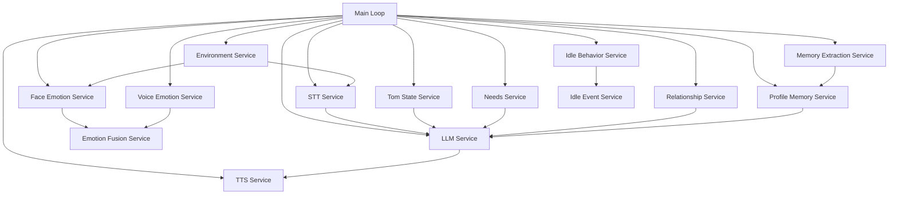

The camera system is built around OpenCV and DeepFace. Its responsibility is to detect whether a person is present, determine how many people are visible, infer dominant emotion from the face, and detect objects using YOLO. The camera thread updates the environment service with person presence, counts, and object changes. Because the runtime needs to respond to both user presence and object changes, this stream is treated as a source of event-like state changes.

The microphone system is built around sounddevice and Whisper. It listens for speech in the background, records a wave file, transcribes it, and exposes the latest text and audio to the main loop. This separation was necessary because continuous listening would block the main thread and make the system feel unresponsive. The STT service runs independently and only hands off recognized text when a complete utterance has been captured.

The LLM service is the current conversational core. It uses a local llama.cpp-backed model and a conversation history stored in MongoDB. Its role is to generate replies with character constraints, relationship context, internal thought hints, and available object observations. The system does not rely on the LLM to manage state directly. The LLM acts as an expressive reasoning layer, not as the system’s source of truth.

Memory is distributed across profile memory and conversation history. Profile memory stores long-lived learned facts about the user in structured form. Conversation history stores recent messages for continuity. The memory extraction service converts utterances into remembered facts, likes, dislikes, and associated importance values. This is important because the project’s long-term vision requires memory to accumulate and decay over time rather than remain a static chat transcript.

The relationship system is intentionally simple but meaningful. Trust, friendship, and attachment are tracked as persistent values. These values influence the relationship prompt passed to the LLM. They are not just decorative. They determine how warm, safe, trusting, or emotionally available Tom appears. This is one of the key architectural choices that moves the system in the direction of a companion rather than a generic chatbot.

The idle behavior subsystem exists to make the pet feel alive even when the user is not actively speaking. It chooses simple actions such as blinking, looking around, stretching, yawning, or seeking attention. Because the current backend has no real animation engine yet, these actions are represented as event objects rather than physical motions. In the current implementation, they are mostly logged and conceptually prepared for later integration into a 3D layer.

Future Godot integration is planned but not presently implemented. The current backend has no explicit bridge to a game engine, no networking protocol for avatar control, and no animation state manager. The architecture therefore assumes that the backend will remain the decision-making core and that a future Godot client will consume the backend’s state and event stream. This separation is deliberate. It keeps the current implementation runnable and testable while leaving a clean path to embodied expression.

## 3. Architectural Philosophy

The architecture is guided by several principles that are visible in almost every service boundary. The first is single responsibility. Each service owns one narrow concern: perception, speech, memory extraction, relationship updates, state persistence, or speech synthesis. This choice exists because the project is evolving quickly and needs to be understandable to developers who may join later. A single class that handled camera input, speech recognition, memory updates, LLM prompting, relationship state, and speech generation would become difficult to reason about and difficult to debug. The service boundaries make the runtime legible.

The second principle is service-oriented architecture, but in a local and pragmatic form. The code is not split into independent networked microservices. Instead, it uses Python classes and explicit runtime collaboration. This was chosen because the system is currently a single-machine backend with local models and a local camera. Full microservices would introduce unnecessary deployment complexity for a project that is still defining its interface and behavior. The present architecture is modular enough to be clear, but lightweight enough to remain practical.

The third principle is loose coupling. The main loop does not directly implement image analysis or speech recognition. Instead, it consumes abstractions such as environment state, STT status, and service methods. The LLM service does not need to know how face tracking works; it only receives prepared context. This is important because the perception stack may change in the future. A different camera pipeline or a different speech engine could replace the existing services without forcing the rest of the system to change dramatically. Loose coupling reduces the cost of architectural evolution.

The fourth principle is high cohesion. Services are built around a single conceptual domain. The relationship service only manages relationship values. The idle behavior service only chooses idle actions. The memory extraction service only extracts memory candidates. This coherence makes the implementation easier to maintain and easier to test. It also supports the project’s long-term goal of turning the system into an emotionally consistent companion rather than an overly generic AI runtime.

The fifth principle is backend-first development. The current architecture intentionally prioritizes a robust backend over an immediate visual frontend. This choice was made because the core challenge is not animation or interface polish. The core challenge is to establish a durable loop of perception, memory, reactions, and expression. The architecture therefore emphasizes internal logic over user interface concerns. This was a deliberate trade-off. It means that the system currently lacks a polished front-end and has no embodied control layer, but it gains a strong internal structure that can later support a richer presentation layer.

The project also values dependency isolation. The LLM service depends on a model file and a MongoDB collection. The STT service depends on the microphone and Whisper. The face service depends on OpenCV and DeepFace. None of these dependencies are allowed to leak deeply into the orchestration layer. This makes the runtime easier to reason about and easier to replace. If Whisper becomes insufficient, the STT service can be reimplemented with a different backend while the rest of the system continues to function.

The architecture also favors modularity over premature optimization. The system is not optimized for large-scale concurrency or enterprise deployment. It is optimized for clarity and extensibility. That choice was appropriate for an early-stage autonomous pet system because the immediate problem was architectural coherence, not scale. The trade-off is that there are still several places where shared mutable state is used directly across threads and where the design would benefit from a central event architecture.

## 4. Complete Startup Sequence

When the program starts, the runtime begins in [AI-Talking-Tom/backend/main.py](AI-Talking-Tom/backend/main.py). The entrypoint is intentionally procedural rather than object-oriented. It constructs the system, starts the background services, performs any necessary migration or initialization, and enters the main loop. This structure is simple and effective for the current stage of development. The startup path can be understood as a sequence of phases.

1. Process launch
   The Python process begins and imports the primary services. The code imports STT, LLM, TTS, face emotion, voice emotion, emotion fusion, state, needs, profile memory, memory extraction, relationship, memory decay, memory metadata, relationship prompt, internal thought, environment, idle behavior, and idle event services. This import stage creates the initial dependency graph.

2. Environment service construction
   An EnvironmentService instance is created first and passed into the STT and face services. This service becomes the shared environment state container for person presence, people count, objects, user leave and return events, and brightness-like context.

3. Speech service construction and background start
   The STT service is created with the environment object and immediately started. The start method creates a background daemon thread that runs the speech listener loop. This means the runtime is prepared to capture microphone input even before the main loop begins.

4. Language and audio service construction
   The LLM and TTS services are created. These services are not started as threads because they are used synchronously when the main loop wants to generate speech or dialogue. Their initialization is lightweight compared to the perception services.

5. Perception service construction and background start
   The face emotion service is created with the environment object and started. It creates a camera capture and launches a background loop that continuously analyzes frames. This makes the camera feed available during runtime without blocking the main loop.

6. Emotion and state services construction
   The voice emotion service, emotion fusion service, memory service, state service, needs service, profile memory service, memory decay service, memory metadata service, memory extraction service, relationship service, relationship prompt service, internal thought service, idle behavior service, and idle event service are all initialized. These services create or load their persistence state from MongoDB.

7. Initial memory decay pass
   If the metadata service determines that daily decay should run, the profile is loaded from MongoDB, passed into the decay service, forgotten memories are removed, and the updated profile is saved back. This ensures that memory importance values do not grow forever without periodic decay.

8. Main loop entry
   The process enters an infinite loop and begins evaluating perceptual and conversational conditions. The loop is the central decision point for runtime behavior.

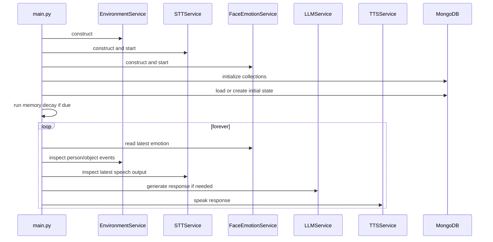

This startup order matters. The system must have a populated environment state and a running speech listener before the main loop can react meaningfully. Starting the camera and STT threads early prevents the main loop from having to wait for the user to begin interacting. The services are also initialized in an order that allows the environment service to be available to both perception systems from the beginning.

A subtle but important part of startup is the one-time memory decay pass. This is not part of the main loop because it is a maintenance task that should happen once per day, not every iteration. Its execution at startup ensures that the system begins from a consistent memory state. Its use of metadata makes it idempotent and easy to reason about.

## 5. Main Loop Architecture

The main loop in [AI-Talking-Tom/backend/main.py](AI-Talking-Tom/backend/main.py) is the operating center of the current backend. It is not intended to contain the implementation of perception, memory extraction, emotional fusion, or LLM prompting. Instead, it orchestrates the services in a specific order so that state updates, event detection, speech processing, memory integration, behavior generation, and speech output happen in a coherent sequence.

The loop performs several high-level actions in order. It reads the latest face emotion from the camera thread. It checks whether the user has returned or left, whether new objects or removed objects were detected, and whether the system should trigger idle behavior. If no speech is available, it may choose an idle action. If speech is present, it will extract memories, retrieve relevant memories, infer emotional tone, update state, generate internal thoughts, ask the LLM for a reply, and speak it aloud.

The ordering exists for a reason. Environment events such as user return or object change are treated as high-priority events and are processed before speech. This avoids the system responding to speech while the user has just entered or exited the scene. The environment state therefore takes precedence over ordinary conversation because it represents a change in the situation rather than a simple message.

Speech processing is placed after the environmental- and idle-related checks. That ensures the loop does not attempt to process audio while a higher-priority environmental event is pending. If the loop were reordered so that speech always took precedence, the system could miss important presence changes or produce a response that conflicts with a new scene event. The current ordering is intentionally conservative.

Memory updates are also performed in a controlled way. Once speech text arrives, the system extracts memory candidates using the memory extraction service. The resulting likes, dislikes, and facts are written into profile memory. Then the loop retrieves relevant memories based on words found in the utterance, sorts them by importance, and passes them into the LLM prompt. This ordering ensures that memory extraction and retrieval happen before response generation so the model can respond with awareness of relevant remembered facts.

Relationship updates and state updates are performed after emotion fusion. The system derives a single mood from face and voice emotion, then updates the relationship service, the Tom state service, and the needs service. This design ties the conversation to the system’s internal state. It prevents the system from acting as if every utterance had no welfare consequence. Each interaction slightly shifts the pet’s energy, curiosity, friendliness, and needs.

The internal thought service is invoked before the LLM response is generated. Its output is a list of lightweight thoughts that shape the tone and topic of the reply. Although these thoughts are not persisted as a separate cognitive state, they function as an abstraction layer that allows the system to express basic internal motivations without requiring a full symbolic planner.

Finally, the LLM generates a response using the collected context. The response text is spoken using the TTS service. This ordering is essential because the system first gathers contextual evidence, then produces an emotionally and relationally informed reply, then renders it in speech. If the order were changed, the system could produce responses that are disconnected from the current state or that ignore newly extracted memory.

## 6. Threading Model

The current implementation uses a small number of threads, but they are essential to keeping the system responsive. The main thread is the supervisory thread. It owns the orchestration loop and coordinates the services. It is also the only thread that is explicitly responsible for the high-level decision flow: observe, decide, respond, and speak. It should remain the point of authority for control flow. It should not contain low-level camera analysis, microphone capture, or long-running model inference if those tasks can be moved to dedicated threads.

The face detection thread is a background thread owned by the face emotion service. Its job is to continuously read frames from the camera, run object detection, run emotion analysis, and update the shared environment state. The thread is not the main thread because camera capture and analysis should not block the main loop. It runs in a loop and updates environment fields such as person present, people count, and new/removed objects. Its main risk is that it updates shared state concurrently with the main loop. In the current implementation, this is accepted as a pragmatic trade-off rather than solved through a full event queue.

The speech recognition thread is launched by the STT service. Its role is to continuously listen for microphone input, capture audio chunks, detect speech boundaries, transcribe them with Whisper, and expose the recognized text and audio to the main loop. The main reason this was redesigned into a background thread is that the original blocking design would have frozen the runtime whenever the system waited for speech. A background listener allows the system to continue monitoring the environment, process other events, and only act on speech when a complete utterance exists.

The current implementation also uses a simple event-like mechanism built around shared variables rather than a formal queue. The main loop checks the environment object for flags such as user_left, user_returned, new_objects, and removed_objects. The STT service exposes latest_text and latest_audio. The face service updates environment state and the main loop reads it. This is simple and effective, but it creates a known risk: shared state can be read while it is being overwritten, and there is no strict serialization of updates.

The future threading model should eventually include a dedicated Godot thread for runtime communication and a dashboard thread for debugging or monitoring. A Godot client would likely need a separate loop to receive state, events, and animation instructions from the backend. A dashboard thread could publish state and memory diagnostics to a local UI or web page. These future threads would exist to avoid blocking the main control loop and to isolate communication concerns from reasoning. The current architecture does not yet have them.

The reason the STT system was redesigned into a background thread is worth documenting explicitly. The original approach, inferred from the evolution of the project and the current use of a background loop, would have caused the runtime to block while waiting for the microphone and for speech to end. That would make the system unresponsive in a way that is unacceptable for a companion. The redesign moved the speech capture path into a long-running background process that decouples recognition from orchestration. The current code uses a threaded listener plus a completion event to coordinate when the main loop should consume the latest text. This is a clear improvement over what would have been a blocking design.

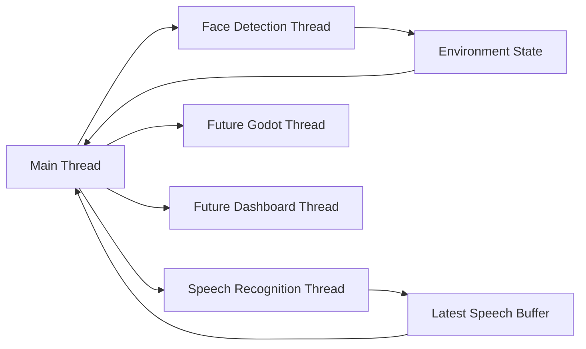

Current implementation limitations include shared mutable state between threads and a lack of a formal event queue. The system is therefore more vulnerable to races than a fully message-driven architecture. That is acceptable for the current developmental stage, but it is a technical debt item that should be addressed in a future revision.

## 7. Data Flow

The system has several important data pipelines, each with distinct inputs, transformations, persistence points, and failure modes.

### Speech pipeline

The speech pipeline begins with microphone input. The STT service captures audio chunks from the sound device. It listens for volume changes and records a complete utterance once the audio stream becomes quiet for a defined period. The recorded audio is written to a local WAV file and passed to the Whisper model for transcription. The output is a text string and an audio array. The main loop then consumes the latest text and audio. The transcribed text is used for memory extraction, profile retrieval, and LLM response generation. The audio array is not used further in the current implementation except as a local captured artifact, but it is the natural input for future voice analysis or replay features.

Inputs: microphone stream, volume threshold, silence duration.
Outputs: transcribed text, audio buffer, listening state.
Services involved: STTService, EnvironmentService, main loop.
Failure cases: low microphone volume, background noise, transcription failure, microphone unavailable, user leaving before speech ends.
Performance concerns: audio capture should avoid blocking the main loop; the current implementation handles this by running speech recognition in a thread.

### Camera pipeline

The camera pipeline begins with frame capture from the local webcam. The face emotion service reads each frame and passes it to the object detection service and the DeepFace emotion analysis call. The object detector returns labels of detected objects; the emotion analysis returns a dominant emotion, region information, and confidence. The environment service updates person presence, person count, and object state based on the results. These updates become input to the main loop and influence event generation. The pipeline is important because it creates the user-presence and environmental context that makes the companion feel responsive.

Inputs: webcam frames.
Outputs: environment state, face emotion, object set.
Services involved: FaceEmotionService, ObjectDetectionService, EnvironmentService.
Failure cases: camera unavailable, inaccurate detection, low-confidence face analysis, object detection returning unstable labels.
Performance concerns: the pipeline is relatively heavy and runs continuously, so it can be a bottleneck on limited hardware.

### Memory pipeline

The memory pipeline begins with transcribed speech text. The memory extraction service sends that text to a local LLM with a prompt that asks for structured memory values: likes, dislikes, and facts. The extracted content is parsed as JSON. The profile memory service then stores these values in MongoDB, increasing importance for repeated items and updating access metadata. Later, the main loop retrieves memories by matching relevant words against the user profile. These retrieved memories are included in the LLM prompt so the conversation can feel informed by prior learning.

Inputs: user utterance text.
Outputs: structured memory entries, profile memory updates, retrieved memories.
Services involved: MemoryExtractionService, ProfileMemoryService, MemoryDecayService, MemoryMetadataService.
Failure cases: invalid JSON output, hallucinated memory, lack of structured extraction, memory decay not yet run.
Performance concerns: LLM-based extraction introduces latency and strong dependence on prompt quality.

### Environment pipeline

The environment pipeline is a lightweight state propagation path. The face service updates the environment service when a person appears, disappears, or changes count. The object detector updates the object list when objects appear or disappear. The environment service computes new_objects and removed_objects and sets flags for user_returned and user_left. These flags are consumed by the main loop to trigger event responses.

Inputs: camera data, object detection results, person presence events.
Outputs: environment flags and object lists.
Services involved: EnvironmentService, FaceEmotionService, ObjectDetectionService.
Failure cases: transient detections, false positives, unstable object sets.
Performance concerns: object change events may be noisy and need smoothing in future versions.

### Idle behavior pipeline

The idle behavior pipeline becomes active when the system is not listening and a period of time has elapsed. The main loop checks whether the idle timer has expired and whether STT is not currently listening. If so, the idle behavior service picks an action based on current energy, sleepiness, hunger, social need, and curiosity. The action is wrapped in an event by the idle event service and logged. This pipeline contributes to the “alive” quality of the system even when the user is not speaking.

Inputs: current state values, elapsed time, listening status.
Outputs: idle action event.
Services involved: IdleBehaviorService, IdleEventService, main loop.
Failure cases: action selection becomes repetitive, no visual or animated response layer yet.
Performance concerns: negligible in current implementation.

### Relationship pipeline

The relationship pipeline is driven by the conversation mood and the emotional state inferred from the interaction. The main loop infers a final emotion from face and voice, creates a combined mood, and passes that mood into the relationship service. The relationship service updates trust, friendship, and attachment values in MongoDB. These values are later used to build a relationship prompt for the LLM so Tom’s tone can reflect social familiarity.

Inputs: mood, conversation context.
Outputs: updated relationship values and prompt context.
Services involved: RelationshipService, RelationshipPromptService, main loop.
Failure cases: relationship values can become overly simplistic, and the current system has no richer social model yet.
Performance concerns: minimal.

### LLM generation pipeline

The LLM generation pipeline combines all the contextual signals the system has available: user utterance, mood, state values, relationship context, retrieved memories, internal thoughts, and visible objects. The LLM service builds a prompt that instructs the model to respond in character. The output is a short, spoken response. The generated message is stored in conversation history and later used as part of the dialogue memory.

Inputs: user text and contextual state.
Outputs: response text, conversation history update.
Services involved: LLMService, main loop, MongoDB.
Failure cases: hallucinations, model performance issues, overly verbose output, prompt injection risk through user text.
Performance concerns: local model inference is costly in both latency and memory.

### TTS pipeline

The TTS pipeline takes the generated response text and renders it through Piper. The TTS service writes audio to a local file, then plays it through the system audio device. This is the current mechanism for giving Tom a voice. The pipeline is simple and effective but synchronous. It blocks the main loop until the speech completes. That is acceptable at this stage but could be improved with an asynchronous playback queue in the future.

Inputs: response text.
Outputs: spoken audio.
Services involved: TTSService.
Failure cases: missing Piper binary, malformed model path, audio playback failure.
Performance concerns: output playback can block the main control loop if not carefully managed.

## 8. Service Interaction Map

The services interact through direct Python method calls, shared runtime objects, and MongoDB persistence. This is not a formally message-driven design, but it is still readable because service boundaries are clear and responsibilities are narrow.

The main loop is the central coordinator. It calls the face emotion service to obtain the latest emotion. It calls the STT service to inspect whether new speech is available. It calls the environment service indirectly through the shared environment object to inspect presence and object change state. It calls the idle behavior service when the system should act without speech. It calls the memory extraction service to transform speech into memory candidates. It calls the profile memory service to store discovered likes, dislikes, and facts. It calls the relationship service to update relationship state. It calls the LLM service to generate a response. It calls the TTS service to speak the response.

The relationship between the main loop and the environment service deserves special attention. The environment service is not just a passive container. It is the shared hub for human presence and object events. The main loop reads it, but the face service writes to it. This makes the environment service the canonical representation of the immediate scene. It is the system’s current situational truth. That is why its state is updated directly by the face detection thread rather than by the main loop. The main loop then reacts to the updated state.

The STT service and the main loop also share state through the latest_text and latest_audio fields. The speech thread writes the completed transcription, and the main loop clears it after consuming it. That design allows the main loop to remain responsive without needing a more formal queue. It is simple but somewhat fragile because the state is not serialized or versioned.

The LLM service is deliberately decoupled from the rest of the state system. It does not directly read the environment or the camera. Instead, it receives a prepared prompt payload that includes the current conversation, emotional state, relationship context, memory text, internal thoughts, and visible objects. This separation is valuable because it means the model can be swapped or reconfigured without rewriting the rest of the runtime.

The profile memory service is a persistence-focused service. It does not build personality directly; it stores memory. The memory extraction service converts user speech into memory candidates, and the profile service decides how to store them. This split is important because the project’s memory architecture should be able to evolve independently from the model-driven extraction logic. It also makes it easier to replace the memory format later without rewriting the extraction prompt.

The relationship service and the Tom state service both enforce their own bounds on the values they manage. They are not fully domain-driven entities with behavioral rules beyond simple clamping. They are state containers with update methods. This is a current simplification, but it is a reasonable first step for a system whose personality is still coarse-grained.

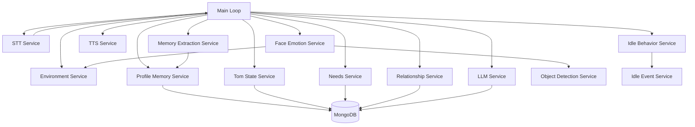

## 9. Current State Management

State management in the current backend is distributed across several services rather than centralized in a single brain-like object. This is both a strength and a limitation. The strength is that each service owns a well-defined slice of state. The limitation is that the system has no single authoritative state manager that can validate transitions or expose all state in a unified way.

Tom state is owned by the TomStateService. It stores the pet’s energy, friendliness, and curiosity in MongoDB under the state collection. These are not just decorative values. They influence the LLM behavior prompt and are updated as a result of conversation and mood. Energy decreases after each interaction. Friendliness changes depending on mood, and curiosity increases after each interaction. The service clamps the values to a fixed range of 0 to 100 and writes updates to MongoDB after each change. The design is simple and effective for the current stage, but it provides no richer behavioral model for motivation or long-term temperament.

Needs are owned by the NeedsService. Hunger, sleepiness, and social need are stored in MongoDB and updated after conversation. Current values influence the internal thought generator and the idle behavior service. The architecture uses simple numeric needs because it needs a lightweight model that can be reasoned about in the current codebase. It is intentionally not a full psychological model. However, this also means the implementation can only do limited emotional planning. That is acceptable for the current stage, but future versions will likely need a more expressive needs system.

Relationships are owned by the RelationshipService. Trust, friendship, and attachment are stored in MongoDB and updated based on the inferred mood. The values feed the relationship prompt service and shape the LLM response’s tone. This is one of the most important parts of the “companion” feeling because it gives the system a memory of prior social connection rather than simply responding to the current utterance.

Emotion exists in two layers. Face emotion is inferred by the face service. Voice emotion is inferred by the voice emotion service. The fusion service combines them into a single emotional signal. The current implementation uses a simple precedence rule: if the face and voice emotion match, that value is used; otherwise, the voice emotion wins if it is non-neutral. This is a pragmatic simplification. It allows the system to react to emotional cues quickly, but it is not a robust theory of affective computation.

Profile memory is owned by the ProfileMemoryService. It stores likes, dislikes, and facts in a structured document keyed by owner. Each entry holds a value, learned_at timestamp, last_accessed timestamp, and importance score. This allows the system to recall what it has learned and adjust how strongly it values the memory. The profile memory is the current long-term memory layer for user-specific knowledge.

Conversation memory is owned by the LLMService. It uses a conversation document in MongoDB to store recent messages. This memory is intentionally short-lived and conversational. It is used to provide continuity within the current runtime and across runs. It is distinct from profile memory because it preserves interaction history rather than stable facts.

Environment state is owned by the EnvironmentService. It is updated by the face service and read by the main loop. The current design uses booleans, counts, and lists rather than a richer event model. That is adequate for the current stage but becomes harder to manage as the system grows.

Idle state is owned by the idle behavior service and the idle event service. The idle timer exists in main.py, while the service itself maintains the last action so that it can avoid repeating the same action continuously. This is a small but important step toward making the pet feel less robotic.

Speech state is owned by the STT service. The service tracks whether it is currently listening, the latest text, and the latest audio. These values are read by the main loop and cleared after consumption. This is efficient but somewhat low-level.

## 10. Database Architecture

MongoDB is used as the central persistence layer for structured state. The project uses a local MongoDB deployment at mongodb://localhost:27017/. The database name is talking_tom. Each service uses a specific collection to store a related class of data. The design is simple and practical for a local prototype. It avoids introducing a complex relational schema while still allowing the system to store structured documents with timestamps, importance scores, and state values.

The collections in the current implementation include:

- state: holds energy, friendliness, and curiosity for the default Tom identity.
- needs: holds hunger, sleepiness, and social need.
- relationship: stores trust, friendship, and attachment.
- profile_memory: stores owner-level likes, dislikes, facts, importance, and timestamps.
- memory: stores conversation history keyed by conversation_id.
- memory_metadata: stores the date of the last memory decay operation.

The profile memory documents are the most complex. Each list entry includes a value, a learned_at timestamp, a last_accessed timestamp, and an importance value. This structure supports both long-term memory and a simple decay model. The design is strong because it lets the system know not only what was remembered, but also how important it is and when it was last used.

Conversation history is stored in the memory collection as a message array. The LLM service uses this history to remain consistent across turns. The history is not an unlimited transcript. It is trimmed to the most recent 20 messages. This is a practical choice that keeps the prompt size bounded while preserving short-term continuity.

The project does not currently implement a rich personality storage layer. The personality is inferred from the prompt instructions, state values, and relationship context rather than from a dedicated structured personality profile. That is an architectural simplification and a clear future direction. The current persistence model is therefore enough for state and memory but not yet enough for a fully expressive digital personality.

The design is intentionally local and single-tenant. The profile memory is hard-coded to the owner Hari. The relationship and state documents are also keyed to a default Tom identity. This makes the implementation simple and testable, but it clearly limits future multi-user or multi-pet support. The architecture can evolve to support multiple users and multiple companions later by changing the document keys and adding identifying fields.

The choice of MongoDB was sensible for the current stage because the project needs flexible schema and easy document insertion. The data is not highly relational; it is mostly state and memory objects. MongoDB provides that flexibility without the overhead of defining a complicated relational schema. It also integrates well with Python and is easy to run locally. The trade-off is that the current code uses the database as a simple document store rather than as a highly normalized system. That is appropriate for the current architecture but should be reconsidered if the system grows into a more formal memory platform.

## 11. Architecture Evolution

The current architecture reflects several important redesigns that occurred during the project’s development. These changes matter because they reveal how the system moved from a simple prototype toward a more persistent companion runtime.

### Current Implementation

The current system uses a background speech thread, an environment state service, a face-based reactive loop, and a persistent memory layer. It is responsive, stateful, and able to maintain continuity over multiple interactions. It also includes simple idle behavior and emotional state updates.

### Original Plan

The original intent, as implied by the project’s goal statement, was to build a virtual pet that could continuously perceive, listen, remember, and react. The system was expected to move beyond a question-answering assistant and toward a living companion. The initial architecture was likely more monolithic and less explicitly separated into services.

### Reason for Change

The project evolved because the initial approach of treating speech recognition as a blocking process would have made the system feel unresponsive. The project also needed a way to store memory and state beyond a single run. As the system became more interactive, it became clear that camera input, speech input, memory extraction, relationship updates, emotional response, and speech output needed separate ownership.

### Benefits

The decomposition into services made debugging easier, allowed the main loop to stay simple, and created a foundation for future multi-modal behavior. The background STT loop improved responsiveness. The use of persistent MongoDB state made the pet feel more continuous and less ephemeral.

### Future Direction

The current design should eventually move to a central brain manager or event queue to reduce direct shared-state coupling. The future architecture will likely wrap each major perception and interaction event in a structured event object so that the system can react more predictably.

The architecture also evolved in the area of memory. Early versions of the system likely emphasized immediate response generation more than memory persistence. The current implementation now explicitly extracts and stores likes, dislikes, facts, and importance values. This is a significant shift from a purely conversational model to a memory-informed companion model.

The idle behavior system itself emerged as a response to the need for autonomous behavior. The project needed more than reactive speech. It needed mechanisms by which Tom could act when not directly engaged. The idle behavior service and idle event service are the current answer to that requirement, even though they are still lightweight and not yet connected to a real animation engine.

The object detection and environment systems were also redesigned from simple presence detection to a more event-driven model. Instead of only reporting that the user is present, the system now produces object change events. That redesign was necessary because the project’s broader goal is not only to talk but also to notice the surroundings and react to them.

## 12. Current Technical Debt

The current architecture is functional, but it carries several important technical debt items.

1. Shared mutable state across threads
   - The face thread and STT thread update shared variables while the main loop reads them.
   - Severity: high.
   - Impact: possible race conditions and subtle nondeterministic behavior.
   - Future fix: formal event queue or message passing.

2. No centralized brain manager
   - The current system lacks a single object that owns high-level reasoning and state transitions.
   - Severity: high.
   - Impact: orchestration logic is spread across main.py and service methods.
   - Future fix: a BrainManager or AgentRuntime that coordinates events and state.

3. No Godot communication layer
   - The backend has no explicit protocol for sending animation, posture, or behavior updates to a future game engine.
   - Severity: medium.
   - Impact: future embodiment will require a new interface layer.
   - Future fix: define a typed event protocol and websocket or TCP bridge.

4. Synchronous TTS playback
   - TTS blocks the main loop until speech completes.
   - Severity: medium.
   - Impact: slows the control loop and reduces responsiveness.
   - Future fix: asynchronous playback queue.

5. Simple relationship and emotion model
   - The relationship system uses three numeric values and a simple prompt mapping.
   - Severity: medium.
   - Impact: personality feels shallow and less dynamic than the project goal suggests.
   - Future fix: richer emotional and social models.

6. Hard-coded owner identity
   - Profile memory and state are keyed around Hari and default Tom identity.
   - Severity: medium.
   - Impact: prevents multi-user and multi-companion support.
   - Future fix: explicit user and companion identity model.

7. No formal event schema
   - The current implementation uses flags and ad hoc events rather than structured event objects.
   - Severity: medium.
   - Impact: difficult to extend and validate.
   - Future fix: event classes and typed payloads.

## 13. Future Architecture

The future architecture should preserve the current service-oriented backend while adding a more explicit control layer. The current services are useful and should remain. They should not be replaced wholesale. Instead, a higher-level coordinator should sit above them and manage event flow and state transitions more deliberately.

A Brain Manager should be introduced as the central orchestrator. Its role would be to consume perception events, state updates, memory retrieval results, and user actions, and then decide the next action. This would replace some of the direct orchestration logic currently embedded in main.py. The existing services would become capabilities rather than the central control plane. The Brain Manager would decide when to speak, when to move, when to remember, and when to engage in idle behavior.

The future personality layer would likely be separate from the current prompt instructions. Rather than relying solely on prompt text, the system would use a persistent personality profile that defines temperament, communication style, attention patterns, and emotional tendencies. That would make Tom feel less like a prompt wrapper and more like a persistent companion.

A dashboard layer would be useful for debugging, monitoring memory, visualizing relationships, and observing current state values. This would be especially important as the system becomes richer and less deterministic. A dashboard thread could subscribe to backend events and present a live view of internal state.

Godot integration should be treated as a separate runtime client that consumes backend events. The backend should not be tightly coupled to the game engine. Instead, a clean interface should be created so the backend can send event descriptions such as speak, blink, look_right, or react_to_user_return. Godot would then choose how to animate those actions. This separation preserves the backend’s role as the reasoning core while allowing the embodiment layer to evolve independently.

Multi-user support is another natural future extension. The current architecture uses a single default owner and a single default Tom identity. A future architecture should support multiple user profiles and multiple relationship states. The persistence model would need to move from simple default documents to more identity-aware storage.

Memory improvements are also necessary. The current memory system uses importance values and last access timestamps, but it is still relatively simple. Future memory should support episodic memory, semantic memory, and procedural memory. It should also support memory consolidation, forgetting strategies, and contextual retrieval. That would make the system feel more like a long-lived companion and less like a prompt-based memory list.

## 14. Architecture Decision Records

### ADR-01: Use a service-oriented backend instead of a single monolithic loop
- Problem: The project needed many distinct capabilities that would become hard to manage in one large function.
- Alternatives: single script, fully distributed microservices.
- Chosen Solution: local Python services with a central orchestrator.
- Advantages: clarity, debugging, extensibility.
- Disadvantages: not a true distributed architecture.
- Long-term impact: supports incremental growth.
- Future reconsideration: if the system becomes large enough to justify networking and deployment isolation.

### ADR-02: Persist state in MongoDB rather than memory-only variables
- Problem: the system needed continuity across runs.
- Alternatives: JSON files, SQLite, pure in-memory state.
- Chosen Solution: MongoDB documents for state, needs, relationships, profile memory, and conversation history.
- Advantages: easy persistence, structured storage, local deployment.
- Disadvantages: requires a running database.
- Long-term impact: makes the system feel persistent.
- Future reconsideration: if the system becomes distributed or requires stronger transactional guarantees.

### ADR-03: Run speech recognition in a background thread
- Problem: blocking speech recognition would freeze the main loop.
- Alternatives: synchronous capture, polling, external service.
- Chosen Solution: background STT listener thread.
- Advantages: responsiveness.
- Disadvantages: shared-state complexity.
- Long-term impact: enables continuous listening behavior.
- Future reconsideration: if a more event-driven architecture is introduced.

### ADR-04: Separate camera perception from the main loop
- Problem: video processing should not block orchestration.
- Alternatives: process frames only when speech occurs.
- Chosen Solution: dedicated face detection thread.
- Advantages: environment updates remain live.
- Disadvantages: concurrency risks.
- Long-term impact: better perception responsiveness.
- Future reconsideration: if the camera pipeline becomes more complex and needs a dedicated process.

### ADR-05: Use the environment service as the situational state hub
- Problem: person presence, object changes, and user leave/return events needed a shared representation.
- Alternatives: keep all flags in main.py.
- Chosen Solution: centralized environment state object.
- Advantages: clear state ownership.
- Disadvantages: still a simple state container rather than a richer state machine.
- Long-term impact: supports future event-driven design.
- Future reconsideration: if a full state machine is introduced.

### ADR-06: Treat the LLM as a response generator, not the system of record
- Problem: the LLM should not own state or memory directly.
- Alternatives: let the LLM manage all state transitions.
- Chosen Solution: keep state in dedicated services and pass it into the LLM as context.
- Advantages: clean separation, easier debugging.
- Disadvantages: more manual state wiring.
- Long-term impact: good foundation for future orchestration.
- Future reconsideration: if the system adopts a more agentic architecture.

### ADR-07: Use a simple numeric model for relationships
- Problem: the system needed a basic representation of social connection.
- Alternatives: no relationship model, complex graph model.
- Chosen Solution: trust, friendship, and attachment values.
- Advantages: simple and understandable.
- Disadvantages: shallow and coarse.
- Long-term impact: supports companion-like behavior.
- Future reconsideration: if relationship modeling becomes more sophisticated.

### ADR-08: Use simple numeric needs for hunger, sleepiness, and social need
- Problem: the system needed a lightweight emotional-state layer.
- Alternatives: no needs model, richer physiological model.
- Chosen Solution: numeric need values.
- Advantages: easy to implement and explain.
- Disadvantages: limited realism.
- Long-term impact: supports idle behavior and internal thought generation.
- Future reconsideration: if the system becomes more biologically or psychologically detailed.

### ADR-09: Use profile memory for stable facts and conversation history for short-term continuity
- Problem: the system needed both durable facts and recent context.
- Alternatives: a single flat memory store.
- Chosen Solution: split memory into profile memory and conversation history.
- Advantages: separation of durable and transient memory.
- Disadvantages: two memory mechanisms can drift out of sync.
- Long-term impact: clearer memory architecture.
- Future reconsideration: if memory is unified into one richer platform.

### ADR-10: Use importance scores and decay for memory management
- Problem: memory would otherwise grow indefinitely.
- Alternatives: no forgetting mechanism.
- Chosen Solution: importance-based memory decay and removal.
- Advantages: memory remains manageable.
- Disadvantages: simple heuristics.
- Long-term impact: supports long-term companion behavior.
- Future reconsideration: if a more elaborate memory consolidation model is built.

### ADR-11: Keep the main loop as an orchestrator rather than a business-logic container
- Problem: the loop would become too complex if it contained all behavior logic.
- Alternatives: move all logic into main.py.
- Chosen Solution: main.py remains high-level control flow.
- Advantages: readability and separation of concerns.
- Disadvantages: orchestration still partially mixed with runtime handling.
- Long-term impact: makes services easier to reuse.
- Future reconsideration: if orchestration becomes more complex than the current loop can manage.

### ADR-12: Use local models instead of external hosted APIs
- Problem: the project needed to run without relying on cloud services.
- Alternatives: OpenAI or cloud-hosted inference.
- Chosen Solution: local llama.cpp and Whisper models.
- Advantages: offline capability, privacy, low operational dependency.
- Disadvantages: lower performance and higher local hardware requirements.
- Long-term impact: makes the system more self-contained.
- Future reconsideration: if the project shifts to a cloud-assisted architecture.

### ADR-13: Use a simple event representation for idle actions
- Problem: the system needed a way to represent non-verbal behavior.
- Alternatives: direct function calls, full animation state updates.
- Chosen Solution: event objects with an action field.
- Advantages: lightweight and easy to extend.
- Disadvantages: not yet connected to animation logic.
- Long-term impact: creates a bridge to future embodiment.
- Future reconsideration: if the system adopts a richer action protocol.

### ADR-14: Let the face service own camera and object detection
- Problem: camera operation and object detection were conceptually tied to perception.
- Alternatives: place camera logic in main.py.
- Chosen Solution: dedicated face service owns this logic.
- Advantages: modularity and clearer perception ownership.
- Disadvantages: the service is somewhat heavy.
- Long-term impact: simplifies future perception upgrades.
- Future reconsideration: if the perception stack becomes distributed.

### ADR-15: Keep the TTS service synchronous for now
- Problem: the system needed a simple way to produce speech.
- Alternatives: asynchronous subprocess management.
- Chosen Solution: synchronous subprocess plus local playback.
- Advantages: simple implementation.
- Disadvantages: blocks the control loop.
- Long-term impact: acceptable for early prototype.
- Future reconsideration: if speech output becomes more central to runtime responsiveness.

### ADR-16: Build the architecture around a default Tom identity
- Problem: the project needed an initial identity to work with.
- Alternatives: fully generic companion architecture from day one.
- Chosen Solution: default tom_id and default owner.
- Advantages: simple and testable.
- Disadvantages: hard-coded identity and limited generality.
- Long-term impact: good starting point for the first companion persona.
- Future reconsideration: if multi-identity support becomes necessary.

### ADR-17: Keep the prompt structure explicit and character-driven
- Problem: the LLM needed strong role instructions to behave like Tom.
- Alternatives: generic prompt or no prompt structure.
- Chosen Solution: explicit system prompt with personality traits, current state, visible objects, and relationship context.
- Advantages: consistent persona.
- Disadvantages: prompt complexity and prompt brittleness.
- Long-term impact: makes the companion feel more coherent.
- Future reconsideration: if the personality layer becomes more structured.

### ADR-18: Use direct Python method calls instead of an IPC layer
- Problem: the system needed to run quickly and locally.
- Alternatives: REST, gRPC, message bus.
- Chosen Solution: direct service calls and shared Python objects.
- Advantages: simplicity, low overhead.
- Disadvantages: less isolation and harder scaling.
- Long-term impact: keeps the runtime simple and fast.
- Future reconsideration: if the system becomes distributed or multi-process.

### ADR-19: Place environment event handling before speech processing in the main loop
- Problem: user-enter and user-leave events should take precedence over ordinary conversation.
- Alternatives: process speech first.
- Chosen Solution: environmental events first, then speech.
- Advantages: better scene awareness.
- Disadvantages: slightly less immediate conversation responsiveness in some cases.
- Long-term impact: higher situational correctness.
- Future reconsideration: if event priority becomes more complex.

### ADR-20: Treat idle behavior as an autonomous layer rather than core conversation
- Problem: the system needed non-verbal autonomy.
- Alternatives: no idle layer, fully scripted behavior.
- Chosen Solution: simple behavior selection based on state.
- Advantages: introduces life-like behavior.
- Disadvantages: still preliminary and non-embodied.
- Long-term impact: creates a bridge to future animation and embodiment.
- Future reconsideration: if the project adds real animation control.

## 15. Lessons Learned

The project has already produced several important lessons, and they are worth preserving because they shaped the architecture that now exists.

The first lesson is that modular services became necessary once the system attempted to do more than answer a single prompt. The project quickly moved beyond simple chat because it needed perception, memory, state, and behavior. That transition made a monolithic architecture untenable. The current service breakdown is therefore not an aesthetic preference. It is an engineering necessity.

The second lesson is that background threads became necessary once the system required continuous listening and continuous perception. A synchronous architecture would have created noticeable delays and would have made the system feel brittle. The thread model is therefore a direct response to the need for responsiveness. It also revealed that shared variables are adequate for a prototype but insufficient for long-term stability.

The third lesson is that memory extraction changed the architecture because memory needed to be structured, not just conversational. The project learned that user information should not remain only in chat logs. It should be recognized as durable knowledge that can shape future responses. That insight led to the profile memory service and to the importance-based memory model.

The fourth lesson is that environment detection evolved from simple camera awareness to event-driven perception. The system discovered that object and presence changes matter not only as raw data but also as triggers for behavior. That is why the environment service now tracks user return, user leave, and object appearance/disappearance.

The fifth lesson is that idle behavior required architectural changes. A companion that only responds when spoken to feels inert. The project therefore introduced a lightweight idle subsystem that can generate autonomous actions and make the pet appear alive even during quiet moments. This is an important turn toward the companion vision.

The sixth lesson is that debugging changed the architecture. Early development likely involved trying to make everything happen in the main loop. Once the system became more concurrent, debugging required clearer ownership boundaries. That is why the current architecture separates concerns into services and why the main loop acts more like a conductor than a container of logic.

The final lesson is that the project should not repeat the mistake of mixing orchestration with low-level implementation. The main loop should remain high-level, while the services own the details. That lesson is especially important as the backend grows toward future Godot integration, richer memory, and more dynamic personality.

## 16. Glossary

- Needs: internal state values such as hunger, sleepiness, and social need that influence behavior.
- Relationship: the system’s persistent social state expressed through trust, friendship, and attachment.
- Memory Importance: a numeric score that determines how strongly a memory is retained and how slowly it decays.
- Idle Behavior: a non-verbal autonomous action chosen when the system is not engaged in direct speech.
- Internal Thoughts: lightweight motivational signals used to influence tone and topic selection.
- Environment Objects: labels of objects detected in the camera view.
- Conversation History: the recent message transcript used for continuity.
- Brain Manager: a future centralized orchestrator for higher-level decisions.
- Godot Connector: a future interface layer between the backend and a 3D game engine.
- Profile Memory: a durable store of likes, dislikes, and facts about the user.
- Emotion Fusion: the process of combining face emotion and voice emotion into one combined emotional signal.
- STT: speech-to-text, implemented here with a background microphone listener and Whisper.
- TTS: text-to-speech, implemented here via Piper and local playback.

## 17. Diagrams

### Overall architecture

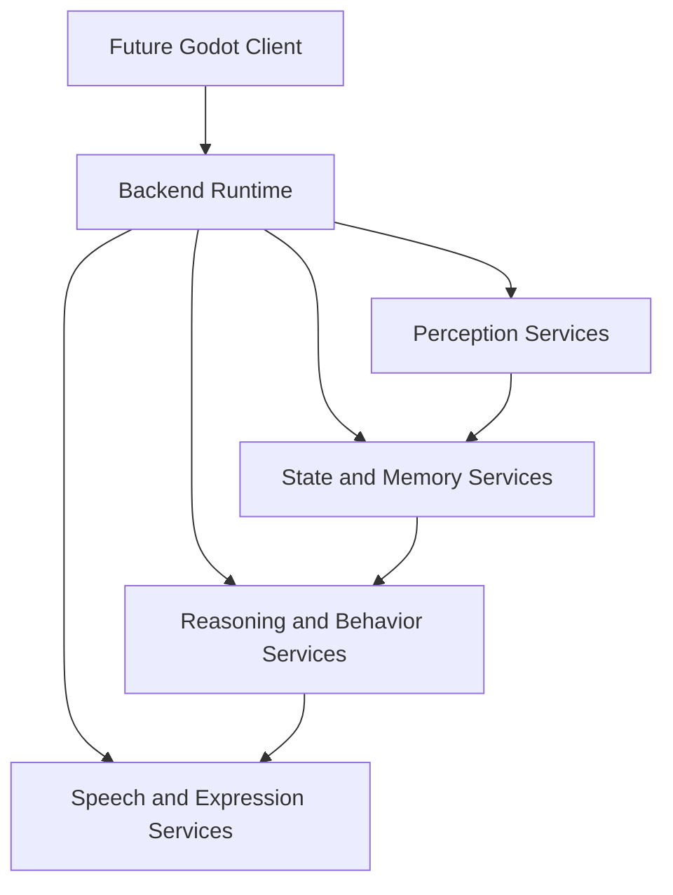

### Startup sequence

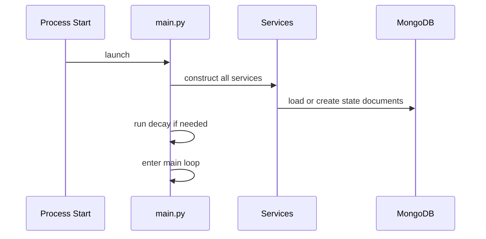

### Thread model

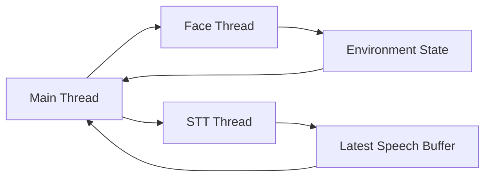

### Speech pipeline

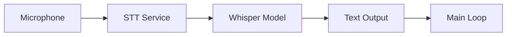

### Environment pipeline

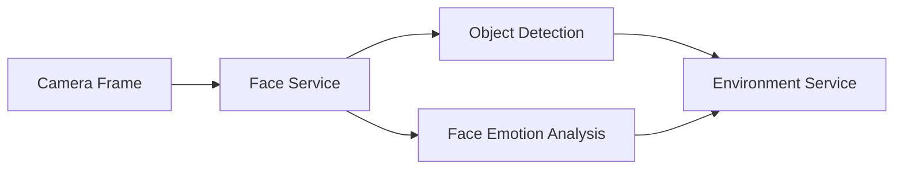

### Memory pipeline

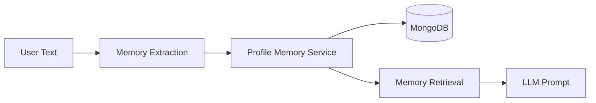

### Relationship pipeline

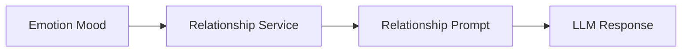

### Idle pipeline

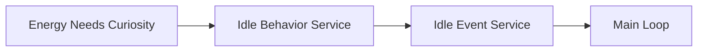

### Future Godot architecture

### Future Brain Manager architecture

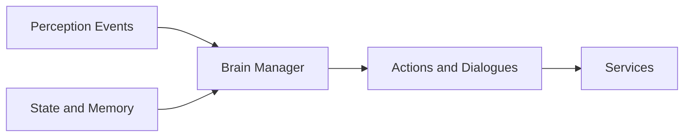

### Service dependency graph

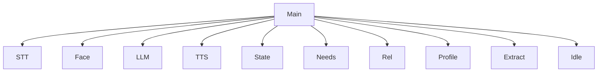

## 18. Writing Style and Usage Notes

This document is written as an engineering design reference rather than as a feature checklist. Its purpose is to explain not only what the system does, but why it is organized in this way and how the current implementation should be understood. A future engineer should be able to read this document and reconstruct the system’s structure, state flow, and rationale without opening every source file. The document is therefore intentionally explicit about responsibilities, ownership, and architectural trade-offs.

When extending the system, developers should preserve the architectural distinctions that are already present. The main loop should stay at the coordination layer. The services should continue to own domain logic. The environment service should remain the representation of scene state. The LLM should remain a content generator rather than the owner of state. This separation is one of the most important features of the current backend and should be protected as the project grows.
