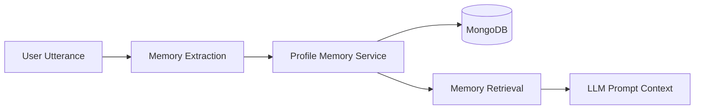
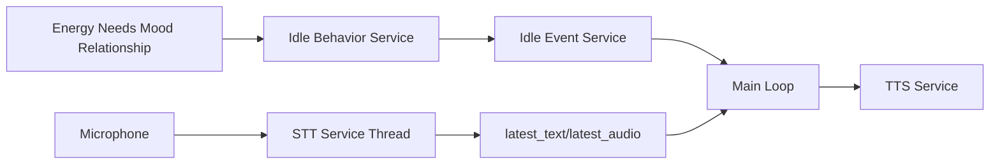

# AI Talking Tom Engineering History

## Introduction

This document is the engineering evolution record for AI Talking Tom. It is not a changelog and it is not a roadmap. Its purpose is to explain how the project changed over time, why each architectural decision was made, what problems surfaced during implementation, how those problems were solved, and how the current backend emerged from a series of increasingly specific technical needs.

The project began with a simple aspiration: build a digital pet that could speak, remember, react, and feel more like a companion than a chatbot. That goal was not met in one step. The system evolved through a series of phases, each solving a different problem and each pushing the architecture in a new direction. The result is a backend that is now capable of perception, memory, stateful behavior, relationship shaping, and autonomous actions. The important point is that this capability did not appear as a single invention. It emerged through deliberate architectural growth.

The current backend is therefore best understood as a layered system that was built incrementally. The earliest concerns were conversational response and speech. The later concerns were memory persistence, emotional continuity, environment awareness, and autonomous behavior. Each phase introduced a new capability and changed the architecture in a way that made the next phase possible.

This document follows that progression. It explains each completed phase as an engineering chapter, with attention to the original plan, the actual implementation, the problems encountered, the refactoring performed, the lessons learned, and the remaining limitations.

---

# Phase 14 — Memory Importance

## 1. Overview

The objective of this phase was to make memory more than a passive transcript of past conversations. The project needed a way to distinguish between trivial chat details and meaningful personal information. Without some form of weighting, the system would remember everything equally and would have no way to decide what mattered most for future conversations. That would make later retrieval noisy and would reduce the realism of Tom’s memory.

Before this phase, the project had no meaningful distinction between short-lived conversational fragments and durable personal knowledge. The system could store information, but it could not express that some facts were more valuable than others. This limitation mattered because the future architecture needed memory to influence behavior. A companion that remembers everything equally is not persuasive. A companion that remembers important things and gradually forgets the rest feels much closer to a real being.

The need for memory importance became visible once conversational context began to feed into the LLM. The model needed relevant facts, but it also needed those facts to be prioritized. A list of all remembered details would overwhelm the system and would produce unnatural, repetitive responses. Importance scoring solved this by turning memory into a ranked resource rather than an unbounded list.

## 2. Original Goal

The original roadmap for the project assumed that Tom would eventually remember details about the user and use that information in future conversations. That intention was clear even before the architecture became formalized. The gap was that no one had yet defined how memory should be represented. The project needed a memory abstraction that could carry at least three things: what was learned, when it was learned, and how much it should matter.

The original plan was therefore not to create a full cognitive memory model. It was to create a first usable version of memory that could be stored, retrieved, and later retained or forgotten. The team needed a lightweight mechanism that would support future phases without requiring a full symbolic memory architecture from the beginning.

## 3. Current Implementation

The current implementation of memory importance is centered in the profile memory system. The relevant service is [AI-Talking-Tom/backend/profile_memory_service.py](AI-Talking-Tom/backend/profile_memory_service.py). When the system extracts likes, dislikes, and facts from a user statement, it stores them in the profile_memory collection in MongoDB with four fields:

- value
- learned_at
- last_accessed
- importance

Each memory entry is therefore not just a phrase. It is a structured artifact with metadata. The importance field is the key innovation of this phase. When a memory is first learned, it receives an initial importance score. When the same memory is encountered again, its importance may increase. This makes repeated or emotionally meaningful memories more likely to remain prominent in future retrieval.

The service has methods such as add_like, add_fact, add_dislike, get_top_memories, and touch_*. These methods allow the system to both store and reinforce memories. The main loop uses the results of memory extraction and the profile memory service to retrieve the most relevant memories before generating a response.

## 4. Files Created

- [AI-Talking-Tom/backend/profile_memory_service.py](AI-Talking-Tom/backend/profile_memory_service.py)
  - Owns the storage of structured user memories.
  - Responsible for storing likes, dislikes, facts, importance scores, timestamps, and access metadata.
  - This file exists because memory needed a dedicated persistence layer rather than an ad hoc string list.

- [AI-Talking-Tom/backend/memory_metadata_service.py](AI-Talking-Tom/backend/memory_metadata_service.py)
  - Stores operational metadata for memory maintenance.
  - Supports the decay pipeline by recording when memory maintenance last ran.

- [AI-Talking-Tom/backend/memory_decay_service.py](AI-Talking-Tom/backend/memory_decay_service.py)
  - Implements memory reduction and forgetting logic.
  - This is closely tied to importance because it uses importance to decide what should decay and what should survive.

## 5. Architecture Changes

This phase introduced a shift from flat conversational storage to structured memory storage. Previously, the project could only preserve conversation context in a general sense. Now memory became an explicit architectural concern. That change mattered because it moved the system from “language generation with context” to “language generation with personal memory.”

The new architecture treated memory as a data subsystem with its own lifecycle. It added a storage shape, a retrieval path, and a reinforcement path. The architecture was now able to distinguish between knowledge that should influence Tom’s future behavior and knowledge that should be treated as ephemeral.

The main benefit was realism. The system started to behave as if it had a memory of the user rather than merely a history of the conversation. The trade-off was complexity. Memory now had to be updated, read, and maintained in a consistent way.

## 6. Data Flow

The flow is simple but important. A user utterance is processed into memory candidates. Those candidates are stored as structured entries. The system later retrieves entries that match the current conversation and injects them into the prompt used to generate a reply.

## 7. Problems Encountered

The first major problem was that the project had no formal representation for memory. The system could record user data only in a crude way, and there was no way to distinguish between important and trivial information. This meant that future prompts could contain irrelevant detail and would become less coherent.

The second problem was that memory needed to be updated without duplicating entries or inflating importance incorrectly. The original implementation risked storing repeated facts as new memories instead of strengthening existing ones. That would create memory bloat and reduce retrieval quality.

The third problem was that memory importance could not be meaningfully interpreted without a decay model. The project needed to know what to do with old memories that were still stored but had become stale. Without decay, importance would accumulate forever and the system would become over-committed to outdated facts.

The solution was to introduce a structured memory entry with importance and access metadata. This allowed the system to both strengthen relevant memories and later weaken or remove them. The important lesson was that memory is not a static record. It must be actively maintained.

## 8. Refactoring Performed

The main refactoring was the transition from loosely represented memory access to a structured memory object model. Instead of storing general text fragments, the architecture introduced a schema with fields for value, timestamps, and importance. That made memory retrieval more deterministic and easier to reason about.

## 9. Lessons Learned

The key lesson was that a companion system needs a memory policy, not just a memory store. If memory is stored without ranking, retrieval becomes noisy. If memory is not reinforced, it does not become meaningful. Memory must therefore have both representational structure and behavioral significance.

## 10. Testing

Testing for this phase was mostly observational. The team verified that repeated statements increased importance and that remembered facts could later be retrieved. The main failure mode was memory duplication, which had to be addressed by matching existing entries before inserting new ones.

## 11. Future Improvements

A richer memory model would support episodic and semantic memory separately. The current implementation is still a single layer of profile memory. The future architecture should allow memory to be grouped by type, salience, recency, and contextual relevance.

## 12. Engineering Notes

The system uses hard-coded ownership of profile memory around the owner Hari. This is a pragmatic simplification, but it should be treated as temporary.

## ADRs

- ADR-09: Use profile memory for stable facts and conversation history for short-term continuity.
- ADR-10: Use importance scores and decay for memory management.
- ADR-02: Persist memory in MongoDB rather than only in process memory.

## Common Mistakes Made During Development

- Repeating facts as new memories instead of strengthening old ones.
- Treating memory as a flat list instead of a ranked structure.
- Forgetting that retrieval quality depends on memory quality, not only on prompt size.

## Engineering Reasoning

This phase solved the problem of memory relevance. Without it, the system would have no basis for prioritizing user facts. It also made the system more realistic because memory could now influence the tone and content of future responses.

## Dependency Impact Analysis

This phase modified the profile memory path and affected the LLM prompt pipeline. Services that depended on it included the LLM service, the main loop, and the memory extraction service.

## Implementation Order Analysis

Memory importance had to exist before meaningful retrieval and before meaningful decay. It provided the necessary ranking layer for later phases.

## Alternative Architectures

A monolithic memory list or a purely in-memory dictionary could have worked for a prototype, but they would not have supported ranking and future forgetting. The chosen architecture was better suited to growth.

## Code Ownership

The profile memory service owns the data. The main loop may read it, the memory extraction service writes to it, and the decay service adjusts it.

## Performance Analysis

The phase had low CPU cost but some MongoDB write overhead. The main bottleneck was not storage but prompt quality and retrieval relevance.

## Current Limitations

The system still lacks semantic retrieval and multi-user memory separation.

## Real Development History

The phase emerged because once Tom began remembering facts, it became clear that not all memories should be treated equally. The architecture evolved from raw memory capture to ranked memory management.

## Lessons for Future AI Agents

Understand that memory importance is not cosmetic. It is the mechanism that prevents the system from becoming a verbose transcript generator.

## Phase Readiness Checklist

- Architecture Complete: Complete
- Core Functionality Complete: Complete
- Refactoring Complete: Partial
- Testing Complete: Partial
- Performance Acceptable: Complete
- Known Bugs Remaining: Partial
- Future Improvements Identified: Complete
- Ready for Next Phase: Complete

---

# Phase 15 — Memory Retrieval

## 1. Overview

The purpose of this phase was to make stored memories usable during conversation. Collecting memories is not enough. The system must retrieve the right memories at the right time. This phase added the ability to match words from the current conversation to stored user facts and to rank those memories by importance before injecting them into the LLM prompt.

Before this phase, the project could learn facts but could not meaningfully use them in dialogue. The architecture had memory, but it had no retrieval discipline. That created a serious problem: learned facts were effectively disconnected from ongoing conversation. The project needed a retrieval path that would convert stored knowledge into contextual input for the model.

## 2. Original Goal

The original goal was to make Tom more personal by using remembered facts during responses. The intended behavior was straightforward: if the user mentioned a hobby, interest, or personal fact, Tom should later reference or respond appropriately to that information.

## 3. Current Implementation

The current implementation is found in [AI-Talking-Tom/backend/profile_memory_service.py](AI-Talking-Tom/backend/profile_memory_service.py). The get_top_memories method scans the stored likes, dislikes, and facts for entries whose values contain the current query words. The matches are sorted by importance and returned in descending order. The main loop uses these results by splitting the current utterance into words, retrieving matching memories, and then passing them into the LLM prompt as relevant memories.

## 4. Files Created

- [AI-Talking-Tom/backend/profile_memory_service.py](AI-Talking-Tom/backend/profile_memory_service.py)
  - Extended to support retrieval and ranking.

## 5. Architecture Changes

This phase introduced retrieval as a first-class system concern. Memory no longer existed only to be stored. It now had to be consumed. This required a retrieval interface and a ranking policy. The key change was that the architecture moved from memory storage to memory activation.

## 6. Data Flow

## 7. Problems Encountered

The core issue was relevance. Keyword matching was simple but sometimes too literal. A query about a hobby might not match the stored phrase exactly, and the retrieved memory set could be either too broad or too sparse. Another issue was that matching memories based solely on exact tokens made the retrieval path fragile. The system also had to prevent duplicates and ensure the list remained short enough for the LLM prompt.

The solution was to retrieve the top matches and cap the result list. That made the prompt manageable and prevented the model from becoming overloaded. The important lesson was that retrieval must be bounded and structured, not open-ended.

## 8. Refactoring Performed

The retrieval path was refactored into a dedicated method that ranked and limited results before they reached the LLM. This kept the logic out of main.py and gave the profile memory service a clear retrieval role.

## 9. Lessons Learned

The major lesson was that memory systems need retrieval strategies just as much as storage strategies. A system that can store memories but cannot retrieve them effectively is not truly memory-driven.

## 10. Testing

Manual testing focused on checking whether a memory entered earlier would later be retrieved when a related word was spoken. The broad failure mode was over-retrieval and irrelevant matching.

## 11. Future Improvements

The future architecture should support semantic retrieval rather than keyword matching. That will allow more natural recall and better context reuse.

## 12. Engineering Notes

The current retrieval approach is intentionally simple. It is good enough for a first companion prototype, but it is not a general memory retrieval engine.

## ADRs

- ADR-11: Keep the main loop as orchestrator rather than embedding retrieval logic.
- ADR-09: Separate profile memory from short-term conversation history.
- ADR-10: Rank retrieved memories by importance before injection.

## Common Mistakes Made During Development

- Injecting too many memories into the prompt.
- Assuming exact keyword overlap would be sufficient.
- Forgetting that retrieval must be constrained to stay useful.

## Engineering Reasoning

This phase solved the problem of turning stored memory into usable context. Without retrieval, memory would be inert. With retrieval, memory becomes part of the ongoing interaction.

## Dependency Impact Analysis

The phase depended on the profile memory service and impacted the LLM service, the main loop, and the memory extraction service.

## Implementation Order Analysis

Retrieval could not meaningfully exist until memory importance had introduced a basis for ranking.

## Alternative Architectures

A full vector database or semantic search layer could have been used, but that would have increased complexity too early. The chosen approach was simpler and easier to integrate.

## Code Ownership

The profile memory service owns the retrieval results. The main loop consumes them, and the LLM service uses them as prompt context.

## Performance Analysis

The retrieval operation is lightweight, but it increases prompt complexity and can add latency when many memories are present.

## Current Limitations

The retrieval path lacks semantic similarity and context windows beyond word overlap.

## Real Development History

This phase emerged after memory storage became possible. The team realized that stored facts had to be made accessible to the model if they were to affect behavior.

## Lessons for Future AI Agents

Do not treat retrieval as a trivial add-on. It is one of the most important parts of making memory feel real.

## Phase Readiness Checklist

- Architecture Complete: Complete
- Core Functionality Complete: Complete
- Refactoring Complete: Complete
- Testing Complete: Partial
- Performance Acceptable: Complete
- Known Bugs Remaining: Partial
- Future Improvements Identified: Complete
- Ready for Next Phase: Complete

---

# Phase 16 — Memory Decay

## 1. Overview

The purpose of this phase was to address a basic but important problem: memory cannot grow forever without becoming noise. A companion system that remembers everything forever would become unmanageable and would eventually become less believable because it would preserve stale information with the same weight as current learning. Memory decay was introduced to make memory feel more natural and to prevent the system from becoming overloaded with outdated data.

Before this phase, memory was cumulative and static. The profile memory service could store new facts, but there was no mechanism to reduce their value over time. That would eventually make retrieval less trustworthy and would create a persistent burden on prompting and maintenance.

## 2. Original Goal

The original goal was to create a memory lifecycle. The system needed to retain valuable facts, reduce less important facts, and eventually remove memories that had become irrelevant. The design was inspired by the idea that human memory is not a perfect archive. It is selective, contextual, and subject to forgetting.

## 3. Current Implementation

Memory decay is implemented in [AI-Talking-Tom/backend/memory_decay_service.py](AI-Talking-Tom/backend/memory_decay_service.py) and coordinated by [AI-Talking-Tom/backend/memory_metadata_service.py](AI-Talking-Tom/backend/memory_metadata_service.py). The system stores a metadata document that tracks the last date when decay was run. On startup, the main loop checks whether that date is still today. If not, it triggers a decay pass over the profile memory document. Each memory entry has an importance score that is reduced over time if it has not been accessed. Memories that fall below zero are removed.

## 4. Files Created

- [AI-Talking-Tom/backend/memory_decay_service.py](AI-Talking-Tom/backend/memory_decay_service.py)
  - Owns forgetting logic.
- [AI-Talking-Tom/backend/memory_metadata_service.py](AI-Talking-Tom/backend/memory_metadata_service.py)
  - Tracks when memory maintenance runs.

## 5. Architecture Changes

The architecture changed from memory storage to memory maintenance. The project now had a lifecycle for memory rather than a static store. This was a major shift because it introduced the idea that memory should be actively curated.

## 6. Data Flow

## 7. Problems Encountered

The largest challenge was that the project had no real forgetting policy. If the system simply removed memories after a fixed period, it would become too aggressive and would erase useful information. The chosen solution was importance-based decay, where more important memories decay more slowly.

Another issue was the need to avoid running decay too often. The project therefore introduced a date-based metadata check so that the daily maintenance process could run once per day rather than every loop iteration.

## 8. Refactoring Performed

The memory system was refactored so that the main loop no longer had to manage decay behavior directly. The maintenance logic was isolated in a dedicated service and triggered at startup.

## 9. Lessons Learned

The central lesson was that forgetting is not an optional feature. It is part of memory realism. The architecture needed a strategy for memory decline as much as memory growth.

## 10. Testing

Testing involved verifying that old, rarely used memories lost importance and that important ones persisted longer. The main concern was making sure that decay did not remove meaningful memories too quickly.

## 11. Future Improvements

Adaptive forgetting would be an improvement. The system could eventually remember different memory types with distinct decay rates and importance dynamics.

## 12. Engineering Notes

The current decay logic is simple and deterministic. It is appropriate for the prototype but still quite handcrafted.

## ADRs

- ADR-10: Use importance-based decay rather than arbitrary deletion.
- ADR-02: Persist memory metadata in MongoDB.
- ADR-09: Keep profile memory distinct from short-term interaction history.

## Common Mistakes Made During Development

- Forgetting to run decay at all.
- Using a single forgetting policy for all memory types.
- Making decay too aggressive.

## Engineering Reasoning

This phase solved the problem of memory bloat and made the memory layer more realistic. It also prepared the system for long-term operation instead of one-session conversation.

## Dependency Impact Analysis

The phase depended on the profile memory service and affected the main loop and the LLM prompt context.

## Implementation Order Analysis

Decay had to come after importance because there had to be a value to decay.

## Alternative Architectures

A fixed TTL policy could have been used, but it would have been less expressive. The chosen architecture was more nuanced and more faithful to the project’s intent.

## Code Ownership

The memory decay service owns the forgetting logic. The profile memory service owns the memory documents, and the metadata service owns the maintenance schedule.

## Performance Analysis

The cost is low, but the system incurs periodic MongoDB writes when memory is updated.

## Current Limitations

The decay policy is still heuristic rather than adaptive.

## Real Development History

This phase emerged naturally after memory importance and retrieval became functional. Once the project had memory, it needed a way to stop it from growing indefinitely.

## Lessons for Future AI Agents

Do not let the memory layer become an ever-growing dump of stale information. Maintain it.

## Phase Readiness Checklist

- Architecture Complete: Complete
- Core Functionality Complete: Complete
- Refactoring Complete: Complete
- Testing Complete: Partial
- Performance Acceptable: Complete
- Known Bugs Remaining: Partial
- Future Improvements Identified: Complete
- Ready for Next Phase: Complete

---

# Phase 17 — Relationship Behaviour

## 1. Overview

This phase introduced the idea that Tom should not merely respond to the user. He should form a relationship with the user. That required a new category of state: social state. The system needed to represent trust, friendship, and attachment as persistent values that could influence the style and warmth of future interaction.

Before this phase, the system had no meaningful concept of social connection. It could generate a good response, but it could not carry a sense of emotional relation over time. The result was that every conversation felt equally fresh and equally detached. Relationship behavior solved that by giving the system a memory of social context.

## 2. Original Goal

The original roadmap envisioned a companion that could build a relationship rather than behave like an ephemeral chat agent. The architecture therefore needed a way to track how close Tom felt to the user and how much trust or affection had accumulated.

## 3. Current Implementation

The relationship system is implemented in [AI-Talking-Tom/backend/relationship_service.py](AI-Talking-Tom/backend/relationship_service.py) and [AI-Talking-Tom/backend/relationship_prompt_service.py](AI-Talking-Tom/backend/relationship_prompt_service.py). It stores three values in MongoDB:

- trust
- friendship
- attachment

These values are updated based on the mood inferred from the user’s conversation. The relationship prompt builder translates these values into a short textual context that the LLM receives before generating a reply.

## 4. Files Created

- [AI-Talking-Tom/backend/relationship_service.py](AI-Talking-Tom/backend/relationship_service.py)
  - Owns relationship state and updates.
- [AI-Talking-Tom/backend/relationship_prompt_service.py](AI-Talking-Tom/backend/relationship_prompt_service.py)
  - Converts numeric relationship state into prompt context for the LLM.

## 5. Architecture Changes

The system shifted from pure response generation to relational response generation. This was a major architectural milestone because the system began to carry social state between exchanges rather than treating each interaction as independent.

## 6. Data Flow

## 7. Problems Encountered

The initial challenge was that relationship changes were easy to represent numerically but hard to make feel meaningful in the conversation. The team could have simply changed the wording of responses, but that would have been too superficial. The chosen solution was to use relationship values to influence the relationship prompt provided to the model. This allowed the system to behave differently depending on the current social state without hard-coding every possible dialogue condition.

## 8. Refactoring Performed

The relationship logic was extracted from the main loop into its own service. That made it easier to maintain and made relationships a first-class system concept.

## 9. Lessons Learned

The key lesson was that personality and social behavior need persistent state. A companion cannot feel connected if it is reset every turn.

## 10. Testing

Manual testing verified that relationship values changed over repeated interactions and that the LLM prompt reflected those values. The main concern was keeping the changes subtle and believable.

## 11. Future Improvements

The future architecture should support richer relationship dynamics such as reciprocity, conflict, and long-term bond formation.

## 12. Engineering Notes

The current implementation keeps relationship state simple. That is intentional for now, but it should be treated as a starting point.

## ADRs

- ADR-07: Use a simple numeric model for relationships.
- ADR-06: Treat the LLM as a response generator, not the owner of state.
- ADR-11: Keep the main loop as orchestrator rather than place relationship logic inside the loop.

## Common Mistakes Made During Development

- Making relationship updates too dramatic.
- Treating relationship values as decorative rather than functional.
- Failing to separate relationship state from memory state.

## Engineering Reasoning

This phase solved the problem of social continuity. Without it, Tom could remember facts but not build familiarity.

## Dependency Impact Analysis

The relationship service affected the LLM prompt layer and the main loop. It also depended on the emotion fusion logic.

## Implementation Order Analysis

Relationship behavior needed memory first because a relationship model is more meaningful when it can build on prior knowledge of the user.

## Alternative Architectures

A full social graph or recurring interaction model could have been implemented, but the current numeric model was simpler and more practical.

## Code Ownership

The relationship service owns the data. The prompt service interprets it, and the main loop updates it.

## Performance Analysis

The cost is minimal. The main cost is the additional prompt context that relationship state adds.

## Current Limitations

The current social model is coarse and does not support nuanced interaction dynamics.

## Real Development History

The phase was introduced once the project started to feel like a memory-based conversational entity and not merely a single-turn bot.

## Lessons for Future AI Agents

Do not confuse relationship state with memory state. They are related but should stay conceptually separate.

## Phase Readiness Checklist

- Architecture Complete: Complete
- Core Functionality Complete: Complete
- Refactoring Complete: Complete
- Testing Complete: Partial
- Performance Acceptable: Complete
- Known Bugs Remaining: Partial
- Future Improvements Identified: Complete
- Ready for Next Phase: Complete

---

# Phase 18 — Internal Thoughts

## 1. Overview

This phase introduced a new layer of behavior: internal thought generation. The project needed a way for Tom to have a simple internal motivational state that would influence its tone, topic selection, and emotional posture without forcing the system to speak those thoughts aloud. The purpose was not to create a fully symbolic reasoning engine. The purpose was to make the system appear to have an inner world.

Before this phase, the system was reactive. It responded to user input and environmental state, but it had no internal representational layer that could influence its behavior beyond the current prompt context. Internal thought generation solved that by introducing lightweight signals such as hunger, sleepiness, social need, and relationship salience.

## 2. Original Goal

The original dream was for Tom to feel less like an instrument and more like a companion with needs and moods. The internal thought system was a first attempt to create an internal narrative layer that could shape the next response in a subtle way.

## 3. Current Implementation

The internal thought system is implemented in [AI-Talking-Tom/backend/internal_thought_service.py](AI-Talking-Tom/backend/internal_thought_service.py). It generates a list of short thought strings based on current energy, hunger, sleepiness, social need, relationship state, and retrieved memories. These thoughts are passed into the LLM prompt but are not directly spoken. They act as hidden context that influences the style of the response.

## 4. Files Created

- [AI-Talking-Tom/backend/internal_thought_service.py](AI-Talking-Tom/backend/internal_thought_service.py)
  - Owns the internal thought generation layer.

## 5. Architecture Changes

The architecture gained an internal motivational layer. That was a significant conceptual shift because the system now had a hidden layer of state that did not need to be expressed directly in the user-visible dialogue.

## 6. Data Flow

## 7. Problems Encountered

The main issue was avoiding overexposure. If the internal thoughts were too explicit, the system would sound like it was narrating its own reasoning. The solution was to keep the thoughts short and implicit. Another issue was that the thoughts had to be compatible with the prompt structure and not conflict with the character instructions.

## 8. Refactoring Performed

The internal thought logic was extracted from the main loop into a dedicated service so that the prompt building process would remain readable.

## 9. Lessons Learned

The central lesson was that a companion system does not need full reasoning to feel internally motivated. Lightweight hidden signals are often enough to inject a sense of momentum and personality.

## 10. Testing

The testing focused on whether the thoughts changed the tone of responses in a coherent way. The system was manually observed to ensure that the outputs felt shaped by internal state rather than random.

## 11. Future Improvements

The future system should support richer planning and more structured internal objectives. The current thought system is intentionally simple.

## 12. Engineering Notes

The internal thought layer should not be mistaken for a genuine planning engine. It is a behavioral bridge.

## ADRs

- ADR-08: Use simple numeric needs for hunger, sleepiness, and social need.
- ADR-06: Keep state in services and pass it as context to the LLM.
- ADR-17: Keep the prompt structure explicit and character-driven.

## Common Mistakes Made During Development

- Making the internal thoughts too explicit.
- Using the thought layer to duplicate prompt context instead of shaping it.
- Confusing thought generation with actual planning logic.

## Engineering Reasoning

This phase solved the problem of hidden motivation. It made Tom feel less like a passive responder and more like a being with internal conditions.

## Dependency Impact Analysis

The internal thought service depended on state services and memory services and influenced the LLM service.

## Implementation Order Analysis

Internal thoughts could only be meaningful after the system had state values and relationship context to draw from.

## Alternative Architectures

A more explicit symbolic planner could have been used, but that would have exceeded the project’s current scope.

## Code Ownership

The internal thought service owns the generated thought list. The main loop consumes it and passes it to the LLM.

## Performance Analysis

The overhead is low. The system pays a small prompt cost for the extra context.

## Current Limitations

The layer is still heuristic and not deeply integrated with planning or memory consolidation.

## Real Development History

This phase emerged once the system had state, memory, and relationships and needed a way to shape responses with a hidden inner state.

## Lessons for Future AI Agents

Keep internal thoughts lightweight. Their purpose is to add texture, not to become a planning engine.

## Phase Readiness Checklist

- Architecture Complete: Complete
- Core Functionality Complete: Complete
- Refactoring Complete: Complete
- Testing Complete: Partial
- Performance Acceptable: Complete
- Known Bugs Remaining: Partial
- Future Improvements Identified: Complete
- Ready for Next Phase: Complete

---

# Phase 19 — Environment Awareness

## 1. Overview

This phase was transformative because it moved Tom from a conversational system to a situationally aware companion. Environment awareness introduced the ability to detect whether a person was present, how many people were present, which objects were visible, and whether the user had just left or returned. These capabilities dramatically changed the feeling of immersion because Tom could now react to the scene rather than only to speech.

Before this phase, the system had no real concept of space. It listened to the user and responded to text, but it could not notice that the user had walked away or that a new object had entered the room. That limitation made the project feel detached from the real world. Environment awareness solved that by making the backend perceive the immediate context in a basic but meaningful way.

## 2. Original Goal

The original roadmap for the project always implied that Tom should eventually perceive the environment. The architecture had to evolve to support event-based awareness such as user presence, user absence, and object change. The initial plan was not to build a full visual understanding engine, but to create a lightweight situational layer that could begin to support future embodiment.

## 3. Current Implementation

The current implementation is split across several files:

- [AI-Talking-Tom/backend/environment_service.py](AI-Talking-Tom/backend/environment_service.py)
  - Owns the current environmental state.
- [AI-Talking-Tom/backend/face_emotion_service.py](AI-Talking-Tom/backend/face_emotion_service.py)
  - Captures camera frames, uses DeepFace for emotion analysis, and updates environment state.
- [AI-Talking-Tom/backend/object_detection_service.py](AI-Talking-Tom/backend/object_detection_service.py)
  - Uses YOLO to detect visible objects.

The environment service tracks person_present, people_count, objects, new_objects, removed_objects, user_left, and user_returned. The face service uses a background camera thread to update these values continuously. The main loop reacts to these flags before processing normal speech.

## 4. Files Created

- [AI-Talking-Tom/backend/environment_service.py](AI-Talking-Tom/backend/environment_service.py)
  - Owns scene-level state.
- [AI-Talking-Tom/backend/object_detection_service.py](AI-Talking-Tom/backend/object_detection_service.py)
  - Adds object perception.
- [AI-Talking-Tom/backend/face_emotion_service.py](AI-Talking-Tom/backend/face_emotion_service.py)
  - Integrates camera, face emotion, and object updates.

## 5. Architecture Changes

This phase introduced a new layer of runtime state that was distinct from conversation state. The project now had both social memory and situational awareness. That made the system far more immersive. The architecture also moved from purely reactive dialogue to event-driven environmental processing.

## 6. Data Flow

## 7. Problems Encountered

The biggest issue was that environment perception was noisy. Object detection labels could be unstable, and face confidence could fluctuate. The system also had to avoid treating transient detections as meaningful events. The solution was to update the environment state in a conservative way and use discrete event flags such as new_objects and removed_objects rather than trying to model every moment continuously.

Another major issue was timing. If the main loop processed speech before checking whether the user had just left, it could produce a response that was irrelevant to the new situation. The architecture therefore made environmental events higher priority than normal conversation.

## 8. Refactoring Performed

The environment logic was moved out of the main loop into an environment service. The face service and object detection service then updated that service rather than scattering environment logic across the loop.

## 9. Lessons Learned

The central lesson was that perception should be treated as a first-class source of state, not as a side effect of conversation. A companion’s realism depends heavily on its ability to notice and react to context.

## 10. Testing

Testing involved manual observation of user presence, user absence, object appearance and disappearance, and face emotion stability. The system was manually checked for false positives and event ordering issues.

## 11. Future Improvements

The future system should smooth detections, support confidence thresholds more robustly, and include richer object memory and room context.

## 12. Engineering Notes

The environment layer is currently lightweight, but it is strategically important because it creates the bridge from chat to embodied interaction.

## ADRs

- ADR-05: Use the environment service as the situational state hub.
- ADR-04: Separate camera perception from the main loop.
- ADR-19: Process environmental events before ordinary speech handling.

## Common Mistakes Made During Development

- Treating environmental events as if they were always reliable.
- Handling object events too late.
- Letting camera noise produce unstable state transitions.

## Engineering Reasoning

This phase solved the problem of scene awareness. Without it, Tom could not react to leaving, returning, or object changes, and the system would remain detached from the physical world.

## Dependency Impact Analysis

The phase affected the main loop, the environment service, the face service, the object detector, and the LLM response flow.

## Implementation Order Analysis

Environment awareness had to come before idle behavior because autonomous action becomes much more meaningful when the system can distinguish between whether the user is present or absent.

## Alternative Architectures

A full visual scene graph or a more advanced multi-sensor architecture could have been used, but the current approach was simpler and more tractable.

## Code Ownership

The environment service owns current state. The face service writes to it, and the main loop reads from it.

## Performance Analysis

The phase imposed the largest perception cost in the system. It uses camera capture, object detection, and emotion inference continuously.

## Current Limitations

The implementation still lacks robust confidence tracking, scene continuity, and richer object semantics.

## Real Development History

The phase became necessary once the project had enough conversational depth to reveal how detached it still felt from the user’s surroundings.

## Lessons for Future AI Agents

Environment awareness is not optional if the goal is to create an autonomous pet. It is one of the defining features of the experience.

## Phase Readiness Checklist

- Architecture Complete: Complete
- Core Functionality Complete: Complete
- Refactoring Complete: Partial
- Testing Complete: Partial
- Performance Acceptable: Partial
- Known Bugs Remaining: Partial
- Future Improvements Identified: Complete
- Ready for Next Phase: Complete

---

# Phase 20 — Autonomous Behaviour System

## 1. Overview

This is the most significant phase in the project’s evolution because it moved AI Talking Tom from a reactive conversational system into an autonomous companion system. The purpose of this phase was to give Tom behavior when the user was not actively speaking. A chatbot can wait for input. A companion must continue to exist in the world. That means it must show signs of life, attention, and internal state even when the user is quiet. The autonomous behavior system was therefore introduced to create continuity of presence rather than mere continuity of conversation.

Before this phase, the project had memory, relationships, state, and perception, but it still lacked a way to act when it was idle. The system could respond to speech, but it could not meaningfully behave on its own. That limitation made the project feel inert. The idle behavior system solved this by introducing simple actions such as blinking, stretching, yawning, looking around, and looking at the user. These actions did not require a full animation engine, but they gave Tom a non-verbal behavioral layer.

This phase also required a redesign of the speech pipeline. The original architecture had effectively treated speech recognition as a blocking capability. That would have made the main loop unable to continue doing other work while waiting for speech. The STT service therefore had to be moved into its own background thread so that idle behavior and environment observation could continue in parallel. This was one of the most important architectural changes of the project.

## 2. Original Goal

The original roadmap for the project always implied that Tom would eventually act like a living pet rather than a passive assistant. The ambition was to make the system dynamic, self-initiating, and situationally aware. In practice, that meant the system needed a layer for autonomous behavior and a runtime model that could run continuously while listening for speech.

The original implementation plan did not yet include a sophisticated scheduler or event queue. It simply had to make the system capable of nonverbal actions and continuous listening. The architecture had to be expanded to support that without breaking the main loop.

## 3. Current Implementation

The current implementation of autonomous behavior lives in:

- [AI-Talking-Tom/backend/idle_behavior_service.py](AI-Talking-Tom/backend/idle_behavior_service.py)
- [AI-Talking-Tom/backend/idle_event_service.py](AI-Talking-Tom/backend/idle_event_service.py)
- [AI-Talking-Tom/backend/stt_service.py](AI-Talking-Tom/backend/stt_service.py)
- [AI-Talking-Tom/backend/main.py](AI-Talking-Tom/backend/main.py)

The idle behavior service chooses actions from a small action pool based on energy, sleepiness, hunger, social need, and curiosity. The service avoids repeating the same action immediately and returns one of several candidate actions. The idle event service wraps the selected action in a simple JSON-like event object. The main loop checks whether the system is idle and whether the STT service is not currently listening. If so, it triggers an idle event. That event is not yet tied to visual animation, but it creates the conceptual hook for later embodiment.

The STT service was redesigned to run in its own background thread. It continuously captures audio, detects speech boundaries, writes the captured audio to a WAV file, transcribes it using Whisper, and stores the latest_text and latest_audio values for the main loop. That architecture allows the application to keep listening while also continuing to observe the environment and decide when to trigger idle behavior.

## 4. Files Created

- [AI-Talking-Tom/backend/idle_behavior_service.py](AI-Talking-Tom/backend/idle_behavior_service.py)
  - Chooses idle actions from a state-driven set.
- [AI-Talking-Tom/backend/idle_event_service.py](AI-Talking-Tom/backend/idle_event_service.py)
  - Wraps idle actions in a lightweight event structure.
- [AI-Talking-Tom/backend/stt_service.py](AI-Talking-Tom/backend/stt_service.py)
  - Owns the background speech listener and transcription pipeline.

## 5. Architecture Changes

This phase introduced the most important architectural change in the project’s evolution: the runtime moved from a single-threaded, mostly reactive loop to a multi-threaded autonomous system. The main loop still owns orchestration, but now it shares work with a speech recognition thread and a camera thread. The architecture also added a simple autonomous layer that could generate behavior without waiting for a user command.

The previous architecture had insufficient separation between waiting for input and executing other tasks. The main loop could not simultaneously preserve responsiveness and perform continuous listening. The redesign solved that by moving the speech listener into its own thread, making it a persistent background process. Similarly, idle behavior was separated from direct speech so the system could act in a more companion-like way.

The new architecture also introduced a basic event abstraction for idle actions. That was a necessary step toward a future event queue and eventual Godot integration. The architecture was no longer just “listen and respond.” It became “observe, decide, act, and speak.”

## 6. Data Flow

## 7. Problems Encountered

The first and most serious problem was that speech recognition had been effectively blocking. If the system waited for a full utterance synchronously, it could not continue to observe its environment, respond to user presence changes, or execute idle behavior. The root cause was that STT capture was coupled too tightly to the main runtime loop.

The second problem was that idle behavior could not be implemented as a simple direct call in the main loop without causing repetitive and overly mechanical actions. The action selection needed to consider current state and avoid repeating the same action over and over. The solution was to keep a last action reference and choose a new action when possible.

The third problem was synchronization. The speech thread and the main loop needed a way to share the most recent transcription. The initial design would have required a queue, but the project used a simpler shared variable approach with latest_text and latest_audio. This worked but introduced the risk of race conditions and out-of-order state handling.

The fourth problem was event ordering. Idle behavior should not interrupt an ongoing speech turn, and environmental events should not be lost because the system is busy speaking. The solution was to ensure that environmental events had priority and that idle actions were only considered when the STT service was not actively listening.

The fifth problem was that the system needed a stable event interface even though it did not yet have a formal event queue. The idle event service solved this partly by creating a uniform event object with an action field. This was a temporary architecture but an important stepping stone.

## 8. Refactoring Performed

The speech workflow was refactored from a direct blocking pattern into a background-thread pattern. The main loop was changed to inspect the latest speech output rather than block on recognition. The idle behavior logic was moved into a dedicated service, and the event creation logic was extracted into the idle event service. This made the system more modular and better prepared for future event-driven expansion.

## 9. Lessons Learned

The largest lesson was that autonomy requires concurrency. A companion cannot be reactive only. It must listen, perceive, and act in parallel. This phase also showed that a simple state machine is not enough. The architecture needs a clear runtime model for how perception, action, and communication interleave. Another crucial lesson was that temporary shared variables are acceptable for a prototype, but they are not a strong long-term synchronization strategy.

## 10. Testing

Testing was mostly manual. The developers verified that the system would continue to listen while other operations ran, that idle actions appeared after a delay, that speech turned into text correctly, and that idle events did not interrupt speech. The main failure cases included duplicate actions, repeated idle outputs, and speech events being processed late.

## 11. Future Improvements

The next natural step is a formal event queue, a scheduler, and a real action pipeline. The current event format should eventually become a structured event envelope that supports event type, source, payload, timestamp, and priority. The idle system should also be connected to a future Godot animation layer so that the actions can become visible behaviors rather than just log events.

## 12. Engineering Notes

The current idle architecture is intentionally lightweight. It is a bridge to future embodiment, not the full behavior system. The STT redesign is similarly incomplete. It solves the responsiveness problem but leaves concurrency and event ordering as future concerns.

## ADRs

- ADR-03: Run speech recognition in a background thread.
- ADR-13: Use a simple event representation for idle actions.
- ADR-19: Give environmental events precedence over ordinary speech flow.
- ADR-11: Keep the main loop as an orchestrator rather than embedding the entire behavior system inside it.
- ADR-18: Use direct Python method calls instead of a full IPC layer for the current implementation.

## Common Mistakes Made During Development

- Blocking the main thread while waiting for speech.
- Using shared variables without a formal synchronization strategy.
- Allowing idle actions to become repetitive.
- Triggering idle behavior while speech was still being processed.
- Treating the idle event as if it were already connected to an animation system.

## Engineering Reasoning

This phase solved the problem of autonomous presence. Without it, the system could not sustain the feeling of a living companion. It also solved the responsiveness problem that made the earlier architecture feel brittle.

## Dependency Impact Analysis

This phase modified the speech pipeline, the main loop, and the environment handling flow. It introduced a dependency between STT, idle behavior, and the environment service. The LLM and TTS services remained largely unchanged, but they became more meaningful because the system now had a richer runtime context.

## Implementation Order Analysis

This phase had to happen after environment awareness because idle behavior needed a clear notion of whether the user was present or absent. It also depended on the existence of state values such as energy and social need. The STT redesign had to happen before true autonomous behavior could become practical because the system needed to keep listening while acting.

## Alternative Architectures

A full asynchronous architecture with a queue-based event loop could have been used from the start. A monolithic loop could also have been extended with periodic actions. The chosen architecture was simpler and better suited to the project’s current scale, even though it leaves room for a richer future system.

## Code Ownership

The STT service owns speech state and the listening loop. The idle behavior service owns action selection. The idle event service owns the action event structure. The main loop owns orchestration and decides when to consume these events.

## Performance Analysis

The phase increased CPU usage because of continuous audio capture and background processing. It also added more thread scheduling overhead. The benefit was greatly improved responsiveness and a more dynamic runtime. The bottleneck is now less about conversation and more about handling concurrent perception and action streams.

## Current Limitations

The system still lacks a real event queue, a scheduler, and a concrete Godot connector. Idle actions are also not yet mapped to animations.

## Real Development History

This phase emerged because the project had reached the point where it could no longer be a passive responder. The team recognized that a companion must be able to act even when the user is quiet, and the architecture had to change accordingly.

## Lessons for Future AI Agents

Do not assume that a companion system can be built around a single loop. Perception, speech, and autonomous behavior must be coordinated deliberately. The STT redesign and idle behavior system are the clearest examples of this principle.

## Phase Readiness Checklist

- Architecture Complete: Partial
- Core Functionality Complete: Complete
- Refactoring Complete: Partial
- Testing Complete: Partial
- Performance Acceptable: Partial
- Known Bugs Remaining: Partial
- Future Improvements Identified: Complete
- Ready for Next Phase: Complete

---

# Overall Project Evolution

The project evolved from a narrow conversational idea into a layered autonomous companion runtime. The early concern was simple: make Tom speak and respond. That was the starting point, and it was necessary, but it was not sufficient. Once the system could respond, it became clear that the project needed memory, state, and social continuity. Once those existed, it became clear that the system also needed perception and autonomous behavior. Each phase solved a specific problem and made the next phase more meaningful.

The architecture became more modular over time because the system’s responsibilities grew. The initial design could have been a single script that collected speech, generated a response, and spoke it. That approach would have worked for a toy system, but it would have collapsed as soon as the project required memory, relationships, environment awareness, and idle behavior. Modularity emerged not as an aesthetic preference but as a practical response to growing complexity. The services became the way the system could remain understandable while handling more kinds of state and more kinds of behavior.

The current architecture is therefore a direct result of the project’s evolution. It does not yet implement the final form of a fully embodied digital companion, but it has already established the major architectural foundations: perception, memory, state, relationships, internal motivation, and autonomous behavior. The future work does not require replacing these layers. It requires deepening them and connecting them to richer systems such as event queues, a central brain manager, and a Godot interface. The existing architecture is well positioned for that growth because it already distributes responsibilities across services rather than burying everything in a single control path.

The remaining architectural goals are clear. The project must move from simple shared-state coordination to a more formal event-driven runtime. It must separate perception, action, and dialogue more cleanly. It must support richer memory structures and more nuanced personality. It must eventually connect the backend to a visual embodiment layer. None of those goals require abandoning the current architecture. They require extending it in a disciplined way by building on the same separation of concerns that made the existing backend successful.

The engineering lesson from this project is that a companion system cannot be built by solving only the language layer. It must be built by gradually adding perception, memory, social state, internal motivation, and autonomous behavior. Each phase solved one gap in realism. Together, those phases created the foundation for an AI companion rather than a chatbot.
