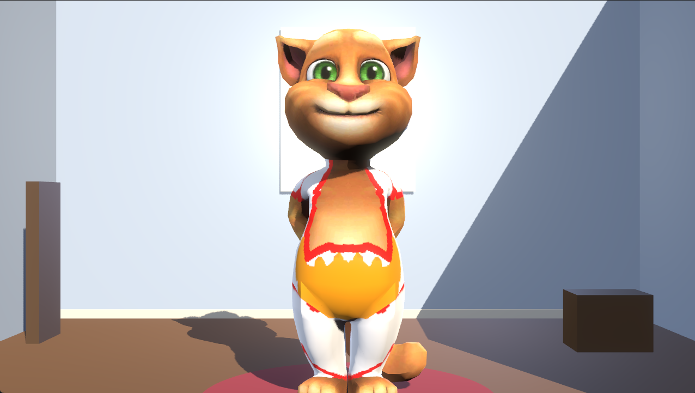
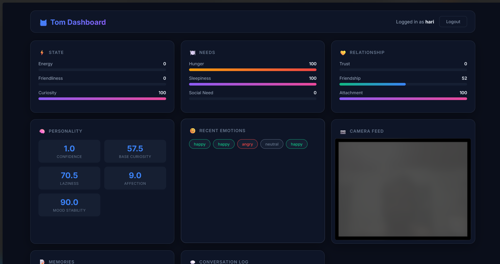
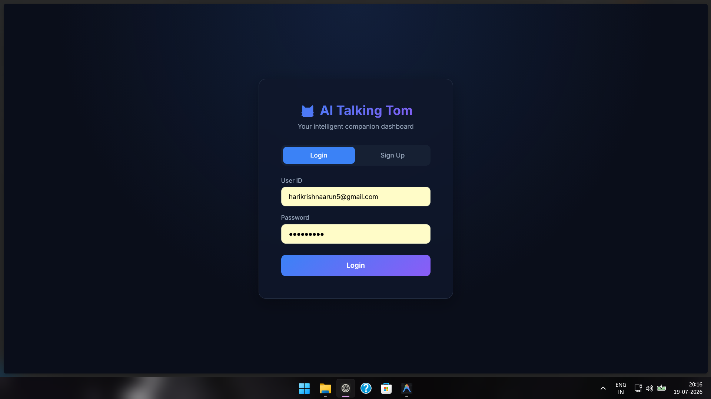
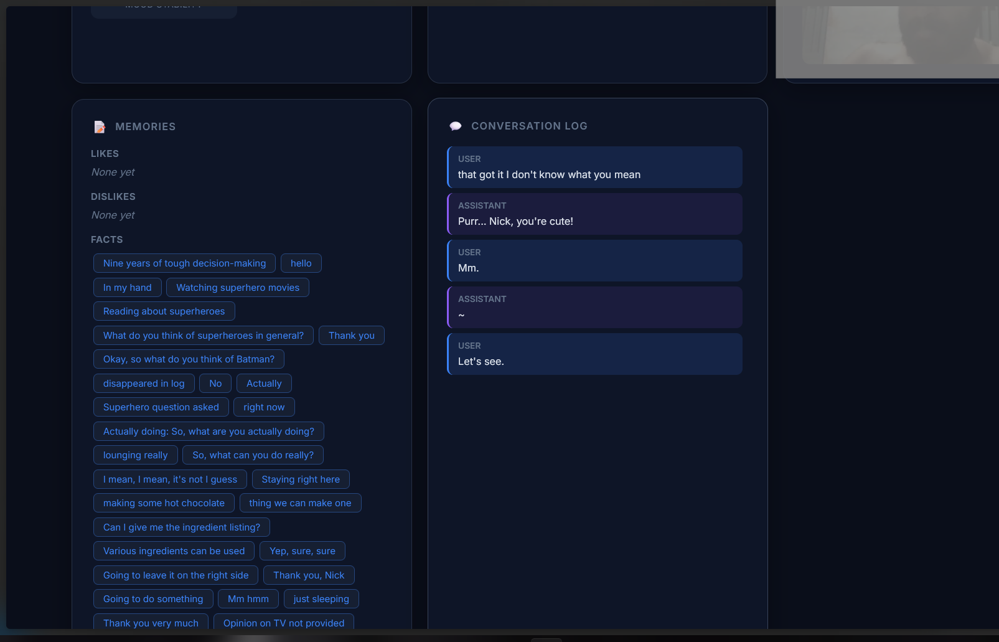

# AI Talking Tom 🐱


<div align="center">
  
</div>

An AI-powered virtual companion built with Godot 4.6, Python, and local LLMs. Tom listens to you, understands emotions, remembers conversations, and responds with personality.

## Features

- **Speech Recognition** — Real-time STT with Faster Whisper
- **Local LLM** — Runs entirely offline using llama.cpp
- **Text-to-Speech** — Natural voice with Piper TTS
- **Emotion Detection** — Face + voice emotion fusion (83% on RAVDESS, see below)
- **Memory System** — Remembers likes, dislikes, facts about you
- **Personality** — Dynamic traits that evolve over conversations
- **3D Avatar** — Animated Talking Tom model with 62 animations and lip sync driven by the voice
- **Dashboard** — Web UI for monitoring Tom's internal state

## Screenshots

*(Please save the screenshots you captured to an `assets/` folder in this repository with these names so they show up properly!)*

### The Talking Tom Avatar


### Web Dashboard & Vitals


### Dashboard Login


### Memories & Conversation Logs


## Architecture

```
┌──────────────┐     TCP/JSON     ┌──────────────┐
│   Godot 4.6  │◄────────────────►│ Python Brain │
│  (3D Avatar) │   Port 9090      │  (Backend)   │
└──────────────┘                  └──────┬───────┘
                                         │
                              ┌──────────┼──────────┐
                              │          │          │
                         ┌────▼───┐ ┌────▼───┐ ┌───▼────┐
                         │  STT   │ │  LLM   │ │  TTS   │
                         │Whisper │ │llama.cpp│ │ Piper  │
                         └────────┘ └────────┘ └────────┘
```

## Quick Start

### Prerequisites
- **Python 3.12** (the pinned dependencies are tested on 3.12)
- **Godot 4.6** — [Download](https://godotengine.org/download)
- **MongoDB** — [Download](https://www.mongodb.com/try/download/community) *(Note: The database and collections are created automatically on first launch. Just install and start the service!)*
- **Git LFS** — `git lfs install`

### Installation

```bash
# Clone the repo
git clone https://github.com/mccool1010/AI_talking_tom_V1.git
cd AI_talking_tom_V1

# Pull LFS files (3D models, binaries)
git lfs pull

# Create Python virtual environment
python -m venv venv
venv\Scripts\activate

# Install dependencies (exact, tested versions)
pip install -r requirements.lock

# Build the web dashboard (served by the backend at http://localhost:8000)
cd dashboard && npm ci && npm run build && cd ..

# Download the LLM model (~2GB, too large for GitHub)
python download_models.py
```

> **Note:** If `download_models.py` fails, download the Qwen 2.5 3B GGUF manually from
> [HuggingFace](https://huggingface.co/Qwen/Qwen2.5-3B-Instruct-GGUF) and place it in `models/llm/`

### Running

**Option 1: Batch launcher**
```bash
run.bat
```

**Option 2: GUI launcher**
```bash
python launcher.py
```

**Option 3: Manual**

The backend logs to the console and to `runtime/logs/tom.log`.
```bash
# Terminal 1: Start backend
cd backend
python main.py

# Terminal 2: Open Godot project
# Open Godot → Import project from godot/ folder → Press F5
```

### AI Models

| Model | Size | How to get |
|---|---|---|
| **Qwen 2.5 3B** (LLM) | 2 GB | `python download_models.py` |
| **Piper TTS voice** | 60 MB | Included in repo |
| **Piper engine** | 20 MB | Included in repo |
| **YOLOv8n** | 6.5 MB | Included in repo |
| **Faster Whisper** | 150 MB | Auto-downloads on first run |
| **DeepFace** | 500 MB | Auto-downloads on first run |
| **wav2vec2 emotion** | 360 MB | Auto-downloads on first run |

## Performance & Evaluation

All numbers below were measured on the machine listed. Everything ran on the CPU.

📊 **Scripts, method and raw results: [benchmarks/](benchmarks/README.md)**. Each section below links to the script that produced it and to its JSON output.

### Hardware

| Component | Spec |
|---|---|
| CPU | Intel Core i7-13620H (10 cores / 16 threads) |
| RAM | 23.6 GB |
| GPU / VRAM | NVIDIA GeForce RTX 5050 Laptop, 8 GB (**not used**: 0 GB VRAM, all models run on the CPU) |
| OS / runtime | Windows 11, Python 3.12, laptop plugged in |

### End-to-end latency (speech in → speech out)

Measured over 12 conversational turns (spoken test phrases, Windows TTS voices), with the camera thread running as in normal use. The time runs from the moment you stop speaking to Tom's first audio sample, including the 1.2 s end-of-turn silence the app waits for.

| | Mean | Median | p90 |
|---|---|---|---|
| End of speech → first audio | **6.5 s** | 6.3 s | 6.7 s |
| Same, camera thread off | 5.4 s | 5.5 s | 5.7 s |

The original version of this project took 15.7 s (p90 21.0 s) on the same machine.

Script: [bench_pipeline.py](benchmarks/bench_pipeline.py) · Raw data: [pipeline.json](benchmarks/results/pipeline.json)

### Per stage

| Stage | Model | Time (mean, camera on) |
|---|---|---|
| Speech-to-text | Faster Whisper `base.en`, int8 | **0.57 s** (word error rate 2%) |
| Voice emotion | wav2vec2 (superb ER) | 0.31 s |
| Memory retrieval | MongoDB + keyword ranking | 3 ms |
| LLM reply | Qwen 2.5 3B Instruct Q4_K_M (llama.cpp) | **3.68 s** for ~1,100 prompt + ~16 reply tokens |
| Text-to-speech | Piper `en_US-lessac-medium` | **0.72 s** per reply (~4.2 s of audio) |
| Memory extraction (after Tom speaks) | same Qwen model | 1.54 s |

**LLM speed:** 15.9 tokens/s generation (5 × 128-token runs). The whole reply, including prompt processing, averages 4.3 tokens/s.

### Peak RAM (all models loaded)

| | |
|---|---|
| Backend process, peak | **6.3 GB** |
| Of which, models after loading | 3.9 GB (Whisper, Qwen, YOLOv8n, DeepFace, wav2vec2) |
| Piper TTS process, peak | 153 MB |

The Godot renderer is not included. The original version peaked at 8.5 GB because it loaded Qwen twice.

### Emotion detection (face + voice fusion)

Script: [bench_emotion.py](benchmarks/bench_emotion.py) · Raw data: [emotion.json](benchmarks/results/emotion.json), per clip: [emotion_clips.jsonl](benchmarks/results/emotion_clips.jsonl) · Dataset download: [download_ravdess.py](benchmarks/download_ravdess.py)

**Test set:** [RAVDESS](https://zenodo.org/records/1188976) audio-visual speech clips, actors 01–04 (2 male, 2 female), **240 clips**. The main score uses the **112 clips** whose emotion the voice model can output (neutral, happy, sad, angry). Face: DeepFace, sampled every 0.2 s with a majority vote. Voice: wav2vec2, used only at ≥ 70% confidence. Fusion: face first, voice when the face looks neutral.

| | 4-emotion accuracy (112 clips) | All 240 clips, 8 emotions ("calm" counted as neutral) |
|---|---|---|
| Face only | 60.7% | 43.3% |
| Voice only | 43.8% | 32.1% |
| **Fusion** | **83.0%** (93/112) | 52.9% |
| Always guess the most common emotion | 28.6% | – |

Fusion recall per emotion: neutral 15/16, happy 24/32, sad 25/32, angry 29/32. The original fusion rule scored 61.6%. The fusion rule and the 70% cutoff were chosen on this same set, so treat these numbers as optimistic. The actors are professionals, and results on a laptop webcam and microphone will be lower.

### Memory system

Script: [bench_memory.py](benchmarks/bench_memory.py) · Raw data: [memory.json](benchmarks/results/memory.json)

**Test set:** 30 labelled statements (9 likes, 7 dislikes, 14 facts), each passed through the real extraction model and saved to MongoDB, plus one follow-up question per statement and 10 unrelated questions.

| Metric | Result |
|---|---|
| Facts retained (saved to the profile) | **30/30 (100%)** |
| Extraction recall | 100% (90% in the right category) |
| Retrieval hit rate: correct memory in top 3 | **29/30 (96.7%)** |
| Retrieval precision@3 | 88% |
| Unrelated questions that retrieved anything | 3/10 |
| Retrieval latency | ~2 ms |
| Forgetting | An unused memory with the default importance of 5 disappears after 11 days; importance ≥ 10 lasts 39–42 days |

The original version saved 37% of these statements (no likes or dislikes at all) and had a 30% hit rate.

## Configuration

Settings live in [backend/config.py](backend/config.py) and can be overridden with
environment variables or a `tom.env` file in the repo root. Copy
[tom.env.example](tom.env.example) to get started. Common settings:

| Variable | Default | Purpose |
|---|---|---|
| `TOM_LLM_GPU_LAYERS` | `-1` | Layers offloaded to the GPU (needs a CUDA build of llama-cpp-python) |
| `TOM_WHISPER_DEVICE` | `auto` | `auto` tries CUDA, then falls back to CPU |
| `TOM_STT_SILENCE_SECONDS` | `1.2` | Silence that ends your turn |
| `TOM_MONGO_URI` | `mongodb://localhost:27017/` | MongoDB connection |
| `TOM_API_HOST` | `127.0.0.1` | Dashboard API bind address |

## Security

The dashboard shows the live camera, stored memories and chat history, so:

- The API listens on `127.0.0.1` only. Nothing on your network can reach it unless you change `TOM_API_HOST`.
- Every data endpoint needs a session token from logging in. A session only sees data while its user is the one Tom is talking to.
- The default account has no password and can only log in from the same machine. Give every account a password before exposing the API.
- Repeated failed logins lock the account for 5 minutes.

## Development

```bash
pip install -r requirements-dev.txt
python -m pytest            # unit tests: no models, GPU or MongoDB needed
cd dashboard && npm run lint
```

The `backend/test_*.py` files are manual hardware and model scripts, not part of the test suite.

## Project Structure

```
AI-Talking-Tom/
├── backend/           # Python AI brain
│   ├── main.py        # Service wiring and main loop
│   ├── config.py      # All settings (env / tom.env overridable)
│   ├── llm_service.py # LLM integration
│   ├── stt_service.py # Speech-to-text
│   ├── tts_service.py # Text-to-speech
│   ├── godot_bridge.py# TCP bridge to Godot
│   └── ...            # 20+ service modules
├── godot/             # Godot 4.6 project
│   ├── models/        # 3D models (GLB)
│   ├── scenes/        # Scene files
│   └── scripts/       # GDScript
├── dashboard/         # React/Vite web dashboard
├── piper/             # Piper TTS engine
├── tests/             # pytest suite
├── benchmarks/        # Latency, emotion and memory benchmarks + results
├── launcher.py        # GUI launcher
├── run.bat            # Batch launcher
└── requirements.txt   # Python dependencies
```

## Credits

### 3D Models (CC BY License)
- **Talking Tom Cat 3** — Sketchfab
- **Cartoon Sofa** — Sketchfab
- **Stylized Bookshelf** — Sketchfab
- **Cartoon Table** — Sketchfab
- **Floor Lamp** — Sketchfab
- **Stylized Window** — Sketchfab
- **Potted Plant** — Sketchfab
- **TeaScroll Rug** — Sketchfab

## License

See [license.txt](license.txt)
